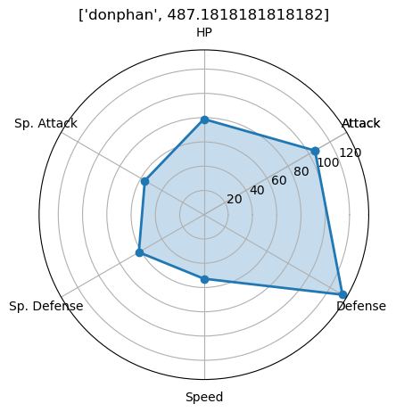

# Statistical Analysis of Pokemon
## EDA, Data Visualization, and Clustering Analysis

Like many men in their late twenties and early thirties, I grew up spellbound by Pokemon. I played the games, watched the show, collected the cards, read the comic books, and even made some of my own with my best friend. As an adult, it's still a guilty pleasure to train and battle in the latest games. I take an admittedly more rigorous approach to the game now, maxing out EVs, IVs, and making sure that my team is strong in the current meta. I enjoy using sites like [Smogon](https://www.smogon.com/) and [Bulbapedia](https://bulbapedia.bulbagarden.net/wiki/Main_Page) but while they are very informative, I have yet to find a strong statistical analysis of Pokemon across the nine generations. This notebook aims to add to that conversation. I will seek to answer a few questions:

1. What can a brief exploratory data analysis tell us about Pokemon? 
2. How have the stats assigned to Pokemon changed throughout the years?
3. Are there clusters of similar Pokemon?

I start by importing my libraries and reading in data from each generation, then combining them into one dataframe. To gather this data I used [Pokebase](https://github.com/PokeAPI/pokebase/tree/master/pokebase), a Python wrapper to [PokeAPI](https://pokeapi.co/). That notebook is also featured on this page.


```python
import pandas as pd
import numpy as np
import seaborn as sns
import warnings
warnings.filterwarnings('ignore')

gen1 = pd.read_csv('data/gen1.csv')
gen1['gen'] = 1
gen2 = pd.read_csv('data/gen2.csv')
gen2['gen'] = 2
gen3 = pd.read_csv('data/gen3.csv')
gen3['gen'] = 3
gen4 = pd.read_csv('data/gen4.csv')
gen4['gen'] = 4
gen5 = pd.read_csv('data/gen5.csv')
gen5['gen'] = 5
gen6 = pd.read_csv('data/gen6.csv')
gen6['gen'] = 6
gen7 = pd.read_csv('data/gen7.csv')
gen7['gen'] = 7
gen8 = pd.read_csv('data/gen8.csv')
gen8['gen'] = 8
gen9 = pd.read_csv('data/gen9.csv')
gen9['gen'] = 9

all_gens = pd.concat([gen1, gen2, gen3, gen4, gen5, gen6, gen7, gen8, gen9])
```

A quick look at the summary stats of the dataframe doesn't tell us a ton. There are 1008 total Pokemon, and the mean value for each individual statistic is somewhere in the 70-77 range, with fairly similar values for std, min, and quantiles. Max shows the only real difference between the statistics, showing evidence of some outliers in certain statistics, HP being a particularly high outlier. Height and weight have fairly massive spreads, ranging from extremely small pokemon to huge ones.


```python
all_gens.describe()
```


<div>
<style scoped>
    .dataframe tbody tr th:only-of-type {
        vertical-align: middle;
    }

    .dataframe tbody tr th {
        vertical-align: top;
    }

    .dataframe thead th {
        text-align: right;
    }
</style>
<table border="1" class="dataframe">
  <thead>
    <tr style="text-align: right;">
      <th></th>
      <th>Unnamed: 0</th>
      <th>id</th>
      <th>weight</th>
      <th>height</th>
      <th>hp</th>
      <th>attack</th>
      <th>defense</th>
      <th>spa</th>
      <th>spd</th>
      <th>speed</th>
      <th>gen</th>
    </tr>
  </thead>
  <tbody>
    <tr>
      <th>count</th>
      <td>1008.000000</td>
      <td>1008.000000</td>
      <td>1008.000000</td>
      <td>1008.000000</td>
      <td>1008.000000</td>
      <td>1008.000000</td>
      <td>1008.000000</td>
      <td>1008.000000</td>
      <td>1008.000000</td>
      <td>1008.000000</td>
      <td>1008.000000</td>
    </tr>
    <tr>
      <th>mean</th>
      <td>58.807540</td>
      <td>504.500000</td>
      <td>659.926587</td>
      <td>12.050595</td>
      <td>69.872024</td>
      <td>77.331349</td>
      <td>72.089286</td>
      <td>69.682540</td>
      <td>69.893849</td>
      <td>66.897817</td>
      <td>4.669643</td>
    </tr>
    <tr>
      <th>std</th>
      <td>37.815848</td>
      <td>291.128837</td>
      <td>1200.911869</td>
      <td>12.456096</td>
      <td>26.655113</td>
      <td>29.848464</td>
      <td>29.173010</td>
      <td>29.518284</td>
      <td>26.682503</td>
      <td>28.702156</td>
      <td>2.596497</td>
    </tr>
    <tr>
      <th>min</th>
      <td>0.000000</td>
      <td>1.000000</td>
      <td>1.000000</td>
      <td>1.000000</td>
      <td>1.000000</td>
      <td>5.000000</td>
      <td>5.000000</td>
      <td>10.000000</td>
      <td>20.000000</td>
      <td>5.000000</td>
      <td>1.000000</td>
    </tr>
    <tr>
      <th>25%</th>
      <td>27.750000</td>
      <td>252.750000</td>
      <td>85.000000</td>
      <td>5.000000</td>
      <td>50.000000</td>
      <td>55.000000</td>
      <td>50.000000</td>
      <td>45.000000</td>
      <td>50.000000</td>
      <td>45.000000</td>
      <td>3.000000</td>
    </tr>
    <tr>
      <th>50%</th>
      <td>55.500000</td>
      <td>504.500000</td>
      <td>280.000000</td>
      <td>10.000000</td>
      <td>67.000000</td>
      <td>75.000000</td>
      <td>69.000000</td>
      <td>65.000000</td>
      <td>65.000000</td>
      <td>65.000000</td>
      <td>5.000000</td>
    </tr>
    <tr>
      <th>75%</th>
      <td>85.000000</td>
      <td>756.250000</td>
      <td>680.500000</td>
      <td>15.000000</td>
      <td>83.000000</td>
      <td>100.000000</td>
      <td>90.000000</td>
      <td>90.000000</td>
      <td>85.000000</td>
      <td>87.000000</td>
      <td>7.000000</td>
    </tr>
    <tr>
      <th>max</th>
      <td>155.000000</td>
      <td>1008.000000</td>
      <td>9999.000000</td>
      <td>200.000000</td>
      <td>255.000000</td>
      <td>181.000000</td>
      <td>230.000000</td>
      <td>173.000000</td>
      <td>230.000000</td>
      <td>200.000000</td>
      <td>9.000000</td>
    </tr>
  </tbody>
</table>
</div>


The second step in my EDA was to take a look at how all the stats interact with each other. As expected based on the values seen in the description table, height and weight are very skewed, with most pokemon being small and a select few being very large. 

One intersesting thing to note in this plot: there is a clear hotspot showing a 1:1 trend of Defense (`defense`) and Special Defense (`spd`, not to be confused with `speed`), and to a lesser extent, Attack (`attack`) and Special Attack (`spa`). I expected Speed and Defense/Special Defense to have a negative trend and on outlier points that seems to be the case, however, on the whole there doesn't appear to be much of a relationship.


```python
stats = ["hp","attack","defense","spa","spd","speed"]
all_gens['stat_total'] = all_gens.loc[:,stats].sum(1)
all_gens['primary_type'] = all_gens['primary_type'].astype('category') 
all_gens['secondary_type'] = all_gens['secondary_type'].astype('category')

all_num = ["height","weight","hp","attack","defense","spa","spd","speed","stat_total"]
sns.pairplot(all_gens[all_num], plot_kws={'alpha':0.1})
```


    <seaborn.axisgrid.PairGrid at 0x17296b87070>


    
{:class="img-responsive"}
    


Next, I wanted to examine the correlation between different stats. There is nothing particularly surprising here. `height` and `weight` have a correlation of 0.63, the highest of any individual stats together. `stat_total` is fairly highly correlated with all of the individual stats but that is to be expected- any mon with a particularly high or low value for any stat probably has a high or low `stat_total`. 


```python
corr_mat = all_gens[all_num].corr()
sns.heatmap(corr_mat, annot=True).set_title('Correlation of Statistics')
```


    Text(0.5, 1.0, 'Correlation of Statistics')


    

    


In addition to these statistics, each pokemon has a Primary Type (`primary_type`). The plot below shows the distribution of Primary Types across all generations. Water is the most common Primary Type, while Flying is the least common Primary Type. This is somewhat unexpected, as there are many Flying pokemon in each game. It will be clear in the following plots why this is the case. Another interesting finding here is that of the three "Starter" types (Water, Grass, and Fire), Fire is by far the least common. Nabbing a powerful Fire-type at the beginning of the game will fill a harder-to-plug gap in type coverage than picking either of the other two... as if we needed a scientific reason to pick Charizard.


```python
ax = sns.countplot(data=all_gens, x = 'primary_type', order = all_gens['primary_type'].value_counts().index, palette=['#3399FF','#A9A896', '#77CC55','#AABB22', '#FF4422','#FF5599','#FFCC33','#BBAA66','#775544',
                                                                                                                      '#BB5544','#DDBB55','#AA5599','#7766EE','#6666BB','#AAAABB','#66CCFF','#EE99EE','#8899FF'])
ax.set_xticklabels(ax.get_xticklabels(), rotation=40, ha="right", fontsize=8)
ax.set_title('Primary Type Distribution Across Generations')
ax.plot()
```


    []


    

    


To see how the type distribution changed across generations, I generated a crosstab of `primary_type` and `gen`. The results for the top four (Bug, Normal, Water, and Grass) seem to hold pretty consistently, with others being particularly high or low in certain generations. One interesting point is that there were 14 Poison-type pokemon introduced in the first generation, and no more than 6 in any subsequent generation. 


```python
pd.crosstab(all_gens['primary_type'], all_gens['gen']).sort_values(5, ascending=False)
```


<div>
<style scoped>
    .dataframe tbody tr th:only-of-type {
        vertical-align: middle;
    }

    .dataframe tbody tr th {
        vertical-align: top;
    }

    .dataframe thead th {
        text-align: right;
    }
</style>
<table border="1" class="dataframe">
  <thead>
    <tr style="text-align: right;">
      <th>gen</th>
      <th>1</th>
      <th>2</th>
      <th>3</th>
      <th>4</th>
      <th>5</th>
      <th>6</th>
      <th>7</th>
      <th>8</th>
      <th>9</th>
    </tr>
    <tr>
      <th>primary_type</th>
      <th></th>
      <th></th>
      <th></th>
      <th></th>
      <th></th>
      <th></th>
      <th></th>
      <th></th>
      <th></th>
    </tr>
  </thead>
  <tbody>
    <tr>
      <th>bug</th>
      <td>12</td>
      <td>10</td>
      <td>12</td>
      <td>8</td>
      <td>18</td>
      <td>3</td>
      <td>9</td>
      <td>4</td>
      <td>7</td>
    </tr>
    <tr>
      <th>normal</th>
      <td>22</td>
      <td>15</td>
      <td>18</td>
      <td>17</td>
      <td>17</td>
      <td>4</td>
      <td>12</td>
      <td>5</td>
      <td>7</td>
    </tr>
    <tr>
      <th>water</th>
      <td>28</td>
      <td>18</td>
      <td>24</td>
      <td>13</td>
      <td>17</td>
      <td>5</td>
      <td>9</td>
      <td>10</td>
      <td>9</td>
    </tr>
    <tr>
      <th>grass</th>
      <td>12</td>
      <td>9</td>
      <td>12</td>
      <td>13</td>
      <td>15</td>
      <td>5</td>
      <td>12</td>
      <td>8</td>
      <td>11</td>
    </tr>
    <tr>
      <th>psychic</th>
      <td>8</td>
      <td>7</td>
      <td>8</td>
      <td>7</td>
      <td>14</td>
      <td>3</td>
      <td>6</td>
      <td>5</td>
      <td>2</td>
    </tr>
    <tr>
      <th>dark</th>
      <td>0</td>
      <td>5</td>
      <td>4</td>
      <td>3</td>
      <td>13</td>
      <td>3</td>
      <td>1</td>
      <td>8</td>
      <td>8</td>
    </tr>
    <tr>
      <th>ground</th>
      <td>8</td>
      <td>3</td>
      <td>6</td>
      <td>4</td>
      <td>9</td>
      <td>0</td>
      <td>2</td>
      <td>4</td>
      <td>4</td>
    </tr>
    <tr>
      <th>fire</th>
      <td>12</td>
      <td>8</td>
      <td>6</td>
      <td>5</td>
      <td>8</td>
      <td>8</td>
      <td>6</td>
      <td>5</td>
      <td>7</td>
    </tr>
    <tr>
      <th>electric</th>
      <td>9</td>
      <td>6</td>
      <td>4</td>
      <td>7</td>
      <td>7</td>
      <td>3</td>
      <td>4</td>
      <td>9</td>
      <td>9</td>
    </tr>
    <tr>
      <th>fighting</th>
      <td>7</td>
      <td>2</td>
      <td>4</td>
      <td>2</td>
      <td>7</td>
      <td>3</td>
      <td>4</td>
      <td>8</td>
      <td>3</td>
    </tr>
    <tr>
      <th>dragon</th>
      <td>3</td>
      <td>0</td>
      <td>7</td>
      <td>3</td>
      <td>7</td>
      <td>4</td>
      <td>3</td>
      <td>4</td>
      <td>6</td>
    </tr>
    <tr>
      <th>ice</th>
      <td>2</td>
      <td>4</td>
      <td>6</td>
      <td>3</td>
      <td>6</td>
      <td>2</td>
      <td>0</td>
      <td>5</td>
      <td>3</td>
    </tr>
    <tr>
      <th>rock</th>
      <td>9</td>
      <td>4</td>
      <td>8</td>
      <td>6</td>
      <td>6</td>
      <td>8</td>
      <td>5</td>
      <td>4</td>
      <td>7</td>
    </tr>
    <tr>
      <th>ghost</th>
      <td>3</td>
      <td>1</td>
      <td>4</td>
      <td>6</td>
      <td>5</td>
      <td>4</td>
      <td>4</td>
      <td>4</td>
      <td>4</td>
    </tr>
    <tr>
      <th>steel</th>
      <td>0</td>
      <td>2</td>
      <td>9</td>
      <td>3</td>
      <td>4</td>
      <td>4</td>
      <td>4</td>
      <td>4</td>
      <td>4</td>
    </tr>
    <tr>
      <th>poison</th>
      <td>14</td>
      <td>1</td>
      <td>3</td>
      <td>6</td>
      <td>2</td>
      <td>2</td>
      <td>6</td>
      <td>1</td>
      <td>3</td>
    </tr>
    <tr>
      <th>flying</th>
      <td>0</td>
      <td>0</td>
      <td>0</td>
      <td>0</td>
      <td>1</td>
      <td>2</td>
      <td>0</td>
      <td>4</td>
      <td>2</td>
    </tr>
    <tr>
      <th>fairy</th>
      <td>2</td>
      <td>5</td>
      <td>0</td>
      <td>1</td>
      <td>0</td>
      <td>9</td>
      <td>1</td>
      <td>4</td>
      <td>7</td>
    </tr>
  </tbody>
</table>
</div>


The chart below shows the distributuion of secondary types across generations. The most common seondary type is None, followed by Flying, which is more than twice as common as the next-highest value. Flying is not a common Primary type, but it is by far the most common Secondary type. 


```python
ax = sns.countplot(data=all_gens, x = 'secondary_type', order = all_gens['secondary_type'].value_counts().index, palette = ['#070707', '#8899FF', '#AA5599', '#FF5599', '#DDBB55', '#EE99EE','#BB5544',
                                                                                                                            '#AAAABB','#7766EE','#6666BB','#77CC55','#775544','#3399FF','#66CCFF','#DDBB55','#FF4422','#A9A896','#FFCC33','#AABB22'])
ax.set_xticklabels(ax.get_xticklabels(), rotation=40, ha="right", fontsize=8)
ax.set_title('Secondary Type Distribution Across Generations')
ax.plot()
```


    []


    

    


How frequently do the types co-occur? As we see below, there are a few pairings that are far more common than others. Normal/Flying, Grass/Poison, Bug/Flying, and Bug/Poison are fairly common pairs.


```python
plt_df = all_gens.loc[all_gens['secondary_type'] != 'none']
ctab = pd.crosstab(index=plt_df['primary_type'], columns=plt_df['secondary_type'])
sns.heatmap(ctab, robust = False).set_title('Co-occurance of Types')
```


    Text(0.5, 1.0, 'Co-occurance of Types')


    

    


We've examined how type distribution has changed across generations, but equally interesting (to me) is how stat distribution has changed across generations. How has the meta-game changed through the years? Have the games suffered from stat-creep? The plot below shows a violin plot of `stat_total` with `gen`. We can see that the median `stat_total` does appear to have increased since the original three generations and the distributions are more top-heavy. However, there is one critical point missing from this plot: we are only counting pokemon _introduced_ in each generation, not present in the game. My uneducated guess is that largely, there are already enough "filler" pokemon found in early game or just not used at all. Recent development has focused on introducing new pokemon that are competitively viable or at minimum, viable throughout the campaign.


```python
sns.violinplot( x = all_gens['gen'], y = all_gens['stat_total'], palette = ['#AEB1BA']).set_title('Total Stat Distribution Across Generations')
```


    Text(0.5, 1.0, 'Total Stat Distribution Across Generations')


    

    


# Cluster Analysis 
Having played many of the games, I know that there are certain archetypes of pokemon found throughout the games. Examples include "Starter Pokemon," "Regional Bird," "Regional Mammal/Rat," and "Pseduolegenaries." Competitively, there are also archetypes like "Special Attack Sweeper" and "Defensive Wall." This cluster analysis attempts to programatically identify those archetypes.

To begin, I import the packages, drop irrelevant columns, scale my data, and run `kmeans` to see how many clusters will produce a well-fit model without overfitting. There seems to be a nice drop-off at about 50 clusters. 


```python
from sklearn.cluster import KMeans 
from sklearn import metrics
from sklearn.pipeline import make_pipeline
from sklearn.preprocessing import StandardScaler

X = all_gens.drop(['name', 'id', 'Unnamed: 0', 'gen'],axis = 1)
X = pd.get_dummies(data = X, columns = ['primary_type','secondary_type'])
X = X.drop(['primary_type_normal','secondary_type_none'], axis = 1)
scaler = StandardScaler()
X_trans = scaler.fit_transform(X)

max_clust = 100
scores = []
clust = []
OMP_NUM_THREADS = 4
for i in range(1, max_clust):
    kmeans = KMeans(n_clusters=i, random_state=42, n_init="auto").fit(X_trans)
    score = kmeans.inertia_
    scores.append(score)
    clust.append(i)
    

```


```python
sns.scatterplot(x = clust, y = scores).set_title('Intertia in KMeans Runs of Varying K')
```


    Text(0.5, 1.0, 'Intertia in KMeans Runs of Varying K')


    

    


Identifying clusters is great, but to make the results tractable, I want to find the centroid (most representative) pokemon for each. The code below runs the final iteration kf KMeans with 50 clusters, identifies the centroids, and prints the first few results. We will dig into these more below. On first look, it seems we may have found some of the clusters I hypothesized above: Grass-starters, Water Staters, and Regional Birds.


```python
kmeans_fin = KMeans(n_clusters=50, random_state=42, n_init="auto").fit(X_trans)
labels = kmeans_fin.predict(X_trans)

all_gens['cluster'] = labels

centers = kmeans_fin.cluster_centers_

centroids = []
for i,c in enumerate(centers):
    closest = 100000
    closest_j = 9999999
    for j, v in enumerate(X_trans):

        dist = np.linalg.norm(v - c)
        if dist < closest:
            closest = dist
            closest_j = j
    centroids.append((i,closest_j))
    
import re
centroid_names = []
for clust, idx in centroids:
    mon = all_gens.loc[all_gens.id == idx+1] #matching by dexID, not index, so add one
    n =  re.search("(\d?)([a-z]+)\s", str(mon['name']))
    name = n.group()[:-1]
    centroid_names.append((clust,name))
    
centroid_names[0:5]      
```


    [(0, 'oranguru'),
     (1, 'snivy'),
     (2, 'quaxwell'),
     (3, 'ivysaur'),
     (4, 'pidgeotto')]


Taking a deeper dive into cluster 4, it seems we have found our cluster of regional birds. Interestingly, regional bugs that ere Bug/Flying seem to have been lumped in to this cluster. Cluster 4 also drives home a point found in nearly all the subsequent clusters: because turning typing into one-hot columns results in so many features compared to the stats, these clusters are largely driven by typing. 


```python
all_gens.loc[all_gens['cluster'] == 4]
```


<div>
<style scoped>
    .dataframe tbody tr th:only-of-type {
        vertical-align: middle;
    }

    .dataframe tbody tr th {
        vertical-align: top;
    }

    .dataframe thead th {
        text-align: right;
    }
</style>
<table border="1" class="dataframe">
  <thead>
    <tr style="text-align: right;">
      <th></th>
      <th>Unnamed: 0</th>
      <th>id</th>
      <th>name</th>
      <th>weight</th>
      <th>height</th>
      <th>primary_type</th>
      <th>secondary_type</th>
      <th>hp</th>
      <th>attack</th>
      <th>defense</th>
      <th>spa</th>
      <th>spd</th>
      <th>speed</th>
      <th>gen</th>
      <th>stat_total</th>
      <th>cluster</th>
    </tr>
  </thead>
  <tbody>
    <tr>
      <th>11</th>
      <td>11</td>
      <td>12</td>
      <td>butterfree</td>
      <td>320</td>
      <td>11</td>
      <td>bug</td>
      <td>flying</td>
      <td>60</td>
      <td>45</td>
      <td>50</td>
      <td>90</td>
      <td>80</td>
      <td>70</td>
      <td>1</td>
      <td>395</td>
      <td>4</td>
    </tr>
    <tr>
      <th>15</th>
      <td>15</td>
      <td>16</td>
      <td>pidgey</td>
      <td>18</td>
      <td>3</td>
      <td>normal</td>
      <td>flying</td>
      <td>40</td>
      <td>45</td>
      <td>40</td>
      <td>35</td>
      <td>35</td>
      <td>56</td>
      <td>1</td>
      <td>251</td>
      <td>4</td>
    </tr>
    <tr>
      <th>16</th>
      <td>16</td>
      <td>17</td>
      <td>pidgeotto</td>
      <td>300</td>
      <td>11</td>
      <td>normal</td>
      <td>flying</td>
      <td>63</td>
      <td>60</td>
      <td>55</td>
      <td>50</td>
      <td>50</td>
      <td>71</td>
      <td>1</td>
      <td>349</td>
      <td>4</td>
    </tr>
    <tr>
      <th>17</th>
      <td>17</td>
      <td>18</td>
      <td>pidgeot</td>
      <td>395</td>
      <td>15</td>
      <td>normal</td>
      <td>flying</td>
      <td>83</td>
      <td>80</td>
      <td>75</td>
      <td>70</td>
      <td>70</td>
      <td>101</td>
      <td>1</td>
      <td>479</td>
      <td>4</td>
    </tr>
    <tr>
      <th>20</th>
      <td>20</td>
      <td>21</td>
      <td>spearow</td>
      <td>20</td>
      <td>3</td>
      <td>normal</td>
      <td>flying</td>
      <td>40</td>
      <td>60</td>
      <td>30</td>
      <td>31</td>
      <td>31</td>
      <td>70</td>
      <td>1</td>
      <td>262</td>
      <td>4</td>
    </tr>
    <tr>
      <th>21</th>
      <td>21</td>
      <td>22</td>
      <td>fearow</td>
      <td>380</td>
      <td>12</td>
      <td>normal</td>
      <td>flying</td>
      <td>65</td>
      <td>90</td>
      <td>65</td>
      <td>61</td>
      <td>61</td>
      <td>100</td>
      <td>1</td>
      <td>442</td>
      <td>4</td>
    </tr>
    <tr>
      <th>82</th>
      <td>82</td>
      <td>83</td>
      <td>farfetchd</td>
      <td>150</td>
      <td>8</td>
      <td>normal</td>
      <td>flying</td>
      <td>52</td>
      <td>90</td>
      <td>55</td>
      <td>58</td>
      <td>62</td>
      <td>60</td>
      <td>1</td>
      <td>377</td>
      <td>4</td>
    </tr>
    <tr>
      <th>83</th>
      <td>83</td>
      <td>84</td>
      <td>doduo</td>
      <td>392</td>
      <td>14</td>
      <td>normal</td>
      <td>flying</td>
      <td>35</td>
      <td>85</td>
      <td>45</td>
      <td>35</td>
      <td>35</td>
      <td>75</td>
      <td>1</td>
      <td>310</td>
      <td>4</td>
    </tr>
    <tr>
      <th>84</th>
      <td>84</td>
      <td>85</td>
      <td>dodrio</td>
      <td>852</td>
      <td>18</td>
      <td>normal</td>
      <td>flying</td>
      <td>60</td>
      <td>110</td>
      <td>70</td>
      <td>60</td>
      <td>60</td>
      <td>110</td>
      <td>1</td>
      <td>470</td>
      <td>4</td>
    </tr>
    <tr>
      <th>122</th>
      <td>122</td>
      <td>123</td>
      <td>scyther</td>
      <td>560</td>
      <td>15</td>
      <td>bug</td>
      <td>flying</td>
      <td>70</td>
      <td>110</td>
      <td>80</td>
      <td>55</td>
      <td>80</td>
      <td>105</td>
      <td>1</td>
      <td>500</td>
      <td>4</td>
    </tr>
    <tr>
      <th>11</th>
      <td>11</td>
      <td>163</td>
      <td>hoothoot</td>
      <td>212</td>
      <td>7</td>
      <td>normal</td>
      <td>flying</td>
      <td>60</td>
      <td>30</td>
      <td>30</td>
      <td>36</td>
      <td>56</td>
      <td>50</td>
      <td>2</td>
      <td>262</td>
      <td>4</td>
    </tr>
    <tr>
      <th>12</th>
      <td>12</td>
      <td>164</td>
      <td>noctowl</td>
      <td>408</td>
      <td>16</td>
      <td>normal</td>
      <td>flying</td>
      <td>100</td>
      <td>50</td>
      <td>50</td>
      <td>86</td>
      <td>96</td>
      <td>70</td>
      <td>2</td>
      <td>452</td>
      <td>4</td>
    </tr>
    <tr>
      <th>14</th>
      <td>14</td>
      <td>166</td>
      <td>ledian</td>
      <td>356</td>
      <td>14</td>
      <td>bug</td>
      <td>flying</td>
      <td>55</td>
      <td>35</td>
      <td>50</td>
      <td>55</td>
      <td>110</td>
      <td>85</td>
      <td>2</td>
      <td>390</td>
      <td>4</td>
    </tr>
    <tr>
      <th>41</th>
      <td>41</td>
      <td>193</td>
      <td>yanma</td>
      <td>380</td>
      <td>12</td>
      <td>bug</td>
      <td>flying</td>
      <td>65</td>
      <td>65</td>
      <td>45</td>
      <td>75</td>
      <td>45</td>
      <td>95</td>
      <td>2</td>
      <td>390</td>
      <td>4</td>
    </tr>
    <tr>
      <th>74</th>
      <td>74</td>
      <td>226</td>
      <td>mantine</td>
      <td>2200</td>
      <td>21</td>
      <td>water</td>
      <td>flying</td>
      <td>85</td>
      <td>40</td>
      <td>70</td>
      <td>80</td>
      <td>140</td>
      <td>70</td>
      <td>2</td>
      <td>485</td>
      <td>4</td>
    </tr>
    <tr>
      <th>15</th>
      <td>15</td>
      <td>267</td>
      <td>beautifly</td>
      <td>284</td>
      <td>10</td>
      <td>bug</td>
      <td>flying</td>
      <td>60</td>
      <td>70</td>
      <td>50</td>
      <td>100</td>
      <td>50</td>
      <td>65</td>
      <td>3</td>
      <td>395</td>
      <td>4</td>
    </tr>
    <tr>
      <th>24</th>
      <td>24</td>
      <td>276</td>
      <td>taillow</td>
      <td>23</td>
      <td>3</td>
      <td>normal</td>
      <td>flying</td>
      <td>40</td>
      <td>55</td>
      <td>30</td>
      <td>30</td>
      <td>30</td>
      <td>85</td>
      <td>3</td>
      <td>270</td>
      <td>4</td>
    </tr>
    <tr>
      <th>25</th>
      <td>25</td>
      <td>277</td>
      <td>swellow</td>
      <td>198</td>
      <td>7</td>
      <td>normal</td>
      <td>flying</td>
      <td>60</td>
      <td>85</td>
      <td>60</td>
      <td>75</td>
      <td>50</td>
      <td>125</td>
      <td>3</td>
      <td>455</td>
      <td>4</td>
    </tr>
    <tr>
      <th>26</th>
      <td>26</td>
      <td>278</td>
      <td>wingull</td>
      <td>95</td>
      <td>6</td>
      <td>water</td>
      <td>flying</td>
      <td>40</td>
      <td>30</td>
      <td>30</td>
      <td>55</td>
      <td>30</td>
      <td>85</td>
      <td>3</td>
      <td>270</td>
      <td>4</td>
    </tr>
    <tr>
      <th>27</th>
      <td>27</td>
      <td>279</td>
      <td>pelipper</td>
      <td>280</td>
      <td>12</td>
      <td>water</td>
      <td>flying</td>
      <td>60</td>
      <td>50</td>
      <td>100</td>
      <td>95</td>
      <td>70</td>
      <td>65</td>
      <td>3</td>
      <td>440</td>
      <td>4</td>
    </tr>
    <tr>
      <th>32</th>
      <td>32</td>
      <td>284</td>
      <td>masquerain</td>
      <td>36</td>
      <td>8</td>
      <td>bug</td>
      <td>flying</td>
      <td>70</td>
      <td>60</td>
      <td>62</td>
      <td>100</td>
      <td>82</td>
      <td>80</td>
      <td>3</td>
      <td>454</td>
      <td>4</td>
    </tr>
    <tr>
      <th>39</th>
      <td>39</td>
      <td>291</td>
      <td>ninjask</td>
      <td>120</td>
      <td>8</td>
      <td>bug</td>
      <td>flying</td>
      <td>61</td>
      <td>90</td>
      <td>45</td>
      <td>50</td>
      <td>50</td>
      <td>160</td>
      <td>3</td>
      <td>456</td>
      <td>4</td>
    </tr>
    <tr>
      <th>81</th>
      <td>81</td>
      <td>333</td>
      <td>swablu</td>
      <td>12</td>
      <td>4</td>
      <td>normal</td>
      <td>flying</td>
      <td>45</td>
      <td>40</td>
      <td>60</td>
      <td>40</td>
      <td>75</td>
      <td>50</td>
      <td>3</td>
      <td>310</td>
      <td>4</td>
    </tr>
    <tr>
      <th>9</th>
      <td>9</td>
      <td>396</td>
      <td>starly</td>
      <td>20</td>
      <td>3</td>
      <td>normal</td>
      <td>flying</td>
      <td>40</td>
      <td>55</td>
      <td>30</td>
      <td>30</td>
      <td>30</td>
      <td>60</td>
      <td>4</td>
      <td>245</td>
      <td>4</td>
    </tr>
    <tr>
      <th>10</th>
      <td>10</td>
      <td>397</td>
      <td>staravia</td>
      <td>155</td>
      <td>6</td>
      <td>normal</td>
      <td>flying</td>
      <td>55</td>
      <td>75</td>
      <td>50</td>
      <td>40</td>
      <td>40</td>
      <td>80</td>
      <td>4</td>
      <td>340</td>
      <td>4</td>
    </tr>
    <tr>
      <th>11</th>
      <td>11</td>
      <td>398</td>
      <td>staraptor</td>
      <td>249</td>
      <td>12</td>
      <td>normal</td>
      <td>flying</td>
      <td>85</td>
      <td>120</td>
      <td>70</td>
      <td>50</td>
      <td>60</td>
      <td>100</td>
      <td>4</td>
      <td>485</td>
      <td>4</td>
    </tr>
    <tr>
      <th>27</th>
      <td>27</td>
      <td>414</td>
      <td>mothim</td>
      <td>233</td>
      <td>9</td>
      <td>bug</td>
      <td>flying</td>
      <td>70</td>
      <td>94</td>
      <td>50</td>
      <td>94</td>
      <td>50</td>
      <td>66</td>
      <td>4</td>
      <td>424</td>
      <td>4</td>
    </tr>
    <tr>
      <th>29</th>
      <td>29</td>
      <td>416</td>
      <td>vespiquen</td>
      <td>385</td>
      <td>12</td>
      <td>bug</td>
      <td>flying</td>
      <td>70</td>
      <td>80</td>
      <td>102</td>
      <td>80</td>
      <td>102</td>
      <td>40</td>
      <td>4</td>
      <td>474</td>
      <td>4</td>
    </tr>
    <tr>
      <th>54</th>
      <td>54</td>
      <td>441</td>
      <td>chatot</td>
      <td>19</td>
      <td>5</td>
      <td>normal</td>
      <td>flying</td>
      <td>76</td>
      <td>65</td>
      <td>45</td>
      <td>92</td>
      <td>42</td>
      <td>91</td>
      <td>4</td>
      <td>411</td>
      <td>4</td>
    </tr>
    <tr>
      <th>71</th>
      <td>71</td>
      <td>458</td>
      <td>mantyke</td>
      <td>650</td>
      <td>10</td>
      <td>water</td>
      <td>flying</td>
      <td>45</td>
      <td>20</td>
      <td>50</td>
      <td>60</td>
      <td>120</td>
      <td>50</td>
      <td>4</td>
      <td>345</td>
      <td>4</td>
    </tr>
    <tr>
      <th>82</th>
      <td>82</td>
      <td>469</td>
      <td>yanmega</td>
      <td>515</td>
      <td>19</td>
      <td>bug</td>
      <td>flying</td>
      <td>86</td>
      <td>76</td>
      <td>86</td>
      <td>116</td>
      <td>56</td>
      <td>95</td>
      <td>4</td>
      <td>515</td>
      <td>4</td>
    </tr>
    <tr>
      <th>25</th>
      <td>25</td>
      <td>519</td>
      <td>pidove</td>
      <td>21</td>
      <td>3</td>
      <td>normal</td>
      <td>flying</td>
      <td>50</td>
      <td>55</td>
      <td>50</td>
      <td>36</td>
      <td>30</td>
      <td>43</td>
      <td>5</td>
      <td>264</td>
      <td>4</td>
    </tr>
    <tr>
      <th>26</th>
      <td>26</td>
      <td>520</td>
      <td>tranquill</td>
      <td>150</td>
      <td>6</td>
      <td>normal</td>
      <td>flying</td>
      <td>62</td>
      <td>77</td>
      <td>62</td>
      <td>50</td>
      <td>42</td>
      <td>65</td>
      <td>5</td>
      <td>358</td>
      <td>4</td>
    </tr>
    <tr>
      <th>27</th>
      <td>27</td>
      <td>521</td>
      <td>unfezant</td>
      <td>290</td>
      <td>12</td>
      <td>normal</td>
      <td>flying</td>
      <td>80</td>
      <td>115</td>
      <td>80</td>
      <td>65</td>
      <td>55</td>
      <td>93</td>
      <td>5</td>
      <td>488</td>
      <td>4</td>
    </tr>
    <tr>
      <th>86</th>
      <td>86</td>
      <td>580</td>
      <td>ducklett</td>
      <td>55</td>
      <td>5</td>
      <td>water</td>
      <td>flying</td>
      <td>62</td>
      <td>44</td>
      <td>50</td>
      <td>44</td>
      <td>50</td>
      <td>55</td>
      <td>5</td>
      <td>305</td>
      <td>4</td>
    </tr>
    <tr>
      <th>87</th>
      <td>87</td>
      <td>581</td>
      <td>swanna</td>
      <td>242</td>
      <td>13</td>
      <td>water</td>
      <td>flying</td>
      <td>75</td>
      <td>87</td>
      <td>63</td>
      <td>87</td>
      <td>63</td>
      <td>98</td>
      <td>5</td>
      <td>473</td>
      <td>4</td>
    </tr>
    <tr>
      <th>133</th>
      <td>133</td>
      <td>627</td>
      <td>rufflet</td>
      <td>105</td>
      <td>5</td>
      <td>normal</td>
      <td>flying</td>
      <td>70</td>
      <td>83</td>
      <td>50</td>
      <td>37</td>
      <td>50</td>
      <td>60</td>
      <td>5</td>
      <td>350</td>
      <td>4</td>
    </tr>
    <tr>
      <th>134</th>
      <td>134</td>
      <td>628</td>
      <td>braviary</td>
      <td>410</td>
      <td>15</td>
      <td>normal</td>
      <td>flying</td>
      <td>100</td>
      <td>123</td>
      <td>75</td>
      <td>57</td>
      <td>75</td>
      <td>80</td>
      <td>5</td>
      <td>510</td>
      <td>4</td>
    </tr>
    <tr>
      <th>11</th>
      <td>11</td>
      <td>661</td>
      <td>fletchling</td>
      <td>17</td>
      <td>3</td>
      <td>normal</td>
      <td>flying</td>
      <td>45</td>
      <td>50</td>
      <td>43</td>
      <td>40</td>
      <td>38</td>
      <td>62</td>
      <td>6</td>
      <td>278</td>
      <td>4</td>
    </tr>
    <tr>
      <th>16</th>
      <td>16</td>
      <td>666</td>
      <td>vivillon</td>
      <td>170</td>
      <td>12</td>
      <td>bug</td>
      <td>flying</td>
      <td>80</td>
      <td>52</td>
      <td>50</td>
      <td>90</td>
      <td>50</td>
      <td>89</td>
      <td>6</td>
      <td>411</td>
      <td>4</td>
    </tr>
    <tr>
      <th>9</th>
      <td>9</td>
      <td>731</td>
      <td>pikipek</td>
      <td>12</td>
      <td>3</td>
      <td>normal</td>
      <td>flying</td>
      <td>35</td>
      <td>75</td>
      <td>30</td>
      <td>30</td>
      <td>30</td>
      <td>65</td>
      <td>7</td>
      <td>265</td>
      <td>4</td>
    </tr>
    <tr>
      <th>10</th>
      <td>10</td>
      <td>732</td>
      <td>trumbeak</td>
      <td>148</td>
      <td>6</td>
      <td>normal</td>
      <td>flying</td>
      <td>55</td>
      <td>85</td>
      <td>50</td>
      <td>40</td>
      <td>50</td>
      <td>75</td>
      <td>7</td>
      <td>355</td>
      <td>4</td>
    </tr>
    <tr>
      <th>11</th>
      <td>11</td>
      <td>733</td>
      <td>toucannon</td>
      <td>260</td>
      <td>11</td>
      <td>normal</td>
      <td>flying</td>
      <td>80</td>
      <td>120</td>
      <td>75</td>
      <td>75</td>
      <td>75</td>
      <td>60</td>
      <td>7</td>
      <td>485</td>
      <td>4</td>
    </tr>
    <tr>
      <th>25</th>
      <td>25</td>
      <td>931</td>
      <td>squawkabilly</td>
      <td>24</td>
      <td>6</td>
      <td>normal</td>
      <td>flying</td>
      <td>82</td>
      <td>96</td>
      <td>51</td>
      <td>45</td>
      <td>51</td>
      <td>92</td>
      <td>9</td>
      <td>417</td>
      <td>4</td>
    </tr>
  </tbody>
</table>
</div>


Cluster 45 is also an interesting cluster to examine. We see the successful grouping of Fire/Fighting type starters (at least the second and third evolutions of them) into one group, as well as some unexpected inclusions in Scraggy, Stufful, and Pawmo. Again, we see that all the pokemon in thus cluster have a Secondary Type of Fighting.


```python
all_gens.loc[all_gens['cluster'] == 45]
```


<div>
<style scoped>
    .dataframe tbody tr th:only-of-type {
        vertical-align: middle;
    }

    .dataframe tbody tr th {
        vertical-align: top;
    }

    .dataframe thead th {
        text-align: right;
    }
</style>
<table border="1" class="dataframe">
  <thead>
    <tr style="text-align: right;">
      <th></th>
      <th>Unnamed: 0</th>
      <th>id</th>
      <th>name</th>
      <th>weight</th>
      <th>height</th>
      <th>primary_type</th>
      <th>secondary_type</th>
      <th>hp</th>
      <th>attack</th>
      <th>defense</th>
      <th>spa</th>
      <th>spd</th>
      <th>speed</th>
      <th>gen</th>
      <th>stat_total</th>
      <th>cluster</th>
    </tr>
  </thead>
  <tbody>
    <tr>
      <th>4</th>
      <td>4</td>
      <td>256</td>
      <td>combusken</td>
      <td>195</td>
      <td>9</td>
      <td>fire</td>
      <td>fighting</td>
      <td>60</td>
      <td>85</td>
      <td>60</td>
      <td>85</td>
      <td>60</td>
      <td>55</td>
      <td>3</td>
      <td>405</td>
      <td>45</td>
    </tr>
    <tr>
      <th>5</th>
      <td>5</td>
      <td>257</td>
      <td>blaziken</td>
      <td>520</td>
      <td>19</td>
      <td>fire</td>
      <td>fighting</td>
      <td>80</td>
      <td>120</td>
      <td>70</td>
      <td>110</td>
      <td>70</td>
      <td>80</td>
      <td>3</td>
      <td>530</td>
      <td>45</td>
    </tr>
    <tr>
      <th>4</th>
      <td>4</td>
      <td>391</td>
      <td>monferno</td>
      <td>220</td>
      <td>9</td>
      <td>fire</td>
      <td>fighting</td>
      <td>64</td>
      <td>78</td>
      <td>52</td>
      <td>78</td>
      <td>52</td>
      <td>81</td>
      <td>4</td>
      <td>405</td>
      <td>45</td>
    </tr>
    <tr>
      <th>5</th>
      <td>5</td>
      <td>392</td>
      <td>infernape</td>
      <td>550</td>
      <td>12</td>
      <td>fire</td>
      <td>fighting</td>
      <td>76</td>
      <td>104</td>
      <td>71</td>
      <td>104</td>
      <td>71</td>
      <td>108</td>
      <td>4</td>
      <td>534</td>
      <td>45</td>
    </tr>
    <tr>
      <th>5</th>
      <td>5</td>
      <td>499</td>
      <td>pignite</td>
      <td>555</td>
      <td>10</td>
      <td>fire</td>
      <td>fighting</td>
      <td>90</td>
      <td>93</td>
      <td>55</td>
      <td>70</td>
      <td>55</td>
      <td>55</td>
      <td>5</td>
      <td>418</td>
      <td>45</td>
    </tr>
    <tr>
      <th>6</th>
      <td>6</td>
      <td>500</td>
      <td>emboar</td>
      <td>1500</td>
      <td>16</td>
      <td>fire</td>
      <td>fighting</td>
      <td>110</td>
      <td>123</td>
      <td>65</td>
      <td>100</td>
      <td>65</td>
      <td>65</td>
      <td>5</td>
      <td>528</td>
      <td>45</td>
    </tr>
    <tr>
      <th>65</th>
      <td>65</td>
      <td>559</td>
      <td>scraggy</td>
      <td>118</td>
      <td>6</td>
      <td>dark</td>
      <td>fighting</td>
      <td>50</td>
      <td>75</td>
      <td>70</td>
      <td>35</td>
      <td>70</td>
      <td>48</td>
      <td>5</td>
      <td>348</td>
      <td>45</td>
    </tr>
    <tr>
      <th>37</th>
      <td>37</td>
      <td>759</td>
      <td>stufful</td>
      <td>68</td>
      <td>5</td>
      <td>normal</td>
      <td>fighting</td>
      <td>70</td>
      <td>75</td>
      <td>50</td>
      <td>45</td>
      <td>50</td>
      <td>50</td>
      <td>7</td>
      <td>340</td>
      <td>45</td>
    </tr>
    <tr>
      <th>16</th>
      <td>16</td>
      <td>922</td>
      <td>pawmo</td>
      <td>65</td>
      <td>4</td>
      <td>electric</td>
      <td>fighting</td>
      <td>60</td>
      <td>75</td>
      <td>40</td>
      <td>50</td>
      <td>40</td>
      <td>85</td>
      <td>9</td>
      <td>350</td>
      <td>45</td>
    </tr>
  </tbody>
</table>
</div>


Cluster 10 is less type-driven than the others and is primarily comprised of Legendary Pokemon, as well as Gyarados, Snorlax, Milotic, and Blissey, each powerful non-legendaries. 


```python
all_gens.loc[all_gens['cluster'] == 10]
```


<div>
<style scoped>
    .dataframe tbody tr th:only-of-type {
        vertical-align: middle;
    }

    .dataframe tbody tr th {
        vertical-align: top;
    }

    .dataframe thead th {
        text-align: right;
    }
</style>
<table border="1" class="dataframe">
  <thead>
    <tr style="text-align: right;">
      <th></th>
      <th>Unnamed: 0</th>
      <th>id</th>
      <th>name</th>
      <th>weight</th>
      <th>height</th>
      <th>primary_type</th>
      <th>secondary_type</th>
      <th>hp</th>
      <th>attack</th>
      <th>defense</th>
      <th>spa</th>
      <th>spd</th>
      <th>speed</th>
      <th>gen</th>
      <th>stat_total</th>
      <th>cluster</th>
    </tr>
  </thead>
  <tbody>
    <tr>
      <th>129</th>
      <td>129</td>
      <td>130</td>
      <td>gyarados</td>
      <td>2350</td>
      <td>65</td>
      <td>water</td>
      <td>flying</td>
      <td>95</td>
      <td>125</td>
      <td>79</td>
      <td>60</td>
      <td>100</td>
      <td>81</td>
      <td>1</td>
      <td>540</td>
      <td>10</td>
    </tr>
    <tr>
      <th>142</th>
      <td>142</td>
      <td>143</td>
      <td>snorlax</td>
      <td>4600</td>
      <td>21</td>
      <td>normal</td>
      <td>none</td>
      <td>160</td>
      <td>110</td>
      <td>65</td>
      <td>65</td>
      <td>110</td>
      <td>30</td>
      <td>1</td>
      <td>540</td>
      <td>10</td>
    </tr>
    <tr>
      <th>90</th>
      <td>90</td>
      <td>242</td>
      <td>blissey</td>
      <td>468</td>
      <td>15</td>
      <td>normal</td>
      <td>none</td>
      <td>255</td>
      <td>10</td>
      <td>10</td>
      <td>75</td>
      <td>135</td>
      <td>55</td>
      <td>2</td>
      <td>540</td>
      <td>10</td>
    </tr>
    <tr>
      <th>93</th>
      <td>93</td>
      <td>245</td>
      <td>suicune</td>
      <td>1870</td>
      <td>20</td>
      <td>water</td>
      <td>none</td>
      <td>100</td>
      <td>75</td>
      <td>115</td>
      <td>90</td>
      <td>115</td>
      <td>85</td>
      <td>2</td>
      <td>580</td>
      <td>10</td>
    </tr>
    <tr>
      <th>97</th>
      <td>97</td>
      <td>249</td>
      <td>lugia</td>
      <td>2160</td>
      <td>52</td>
      <td>psychic</td>
      <td>flying</td>
      <td>106</td>
      <td>90</td>
      <td>130</td>
      <td>90</td>
      <td>154</td>
      <td>110</td>
      <td>2</td>
      <td>680</td>
      <td>10</td>
    </tr>
    <tr>
      <th>37</th>
      <td>37</td>
      <td>289</td>
      <td>slaking</td>
      <td>1305</td>
      <td>20</td>
      <td>normal</td>
      <td>none</td>
      <td>150</td>
      <td>160</td>
      <td>100</td>
      <td>95</td>
      <td>65</td>
      <td>100</td>
      <td>3</td>
      <td>670</td>
      <td>10</td>
    </tr>
    <tr>
      <th>98</th>
      <td>98</td>
      <td>350</td>
      <td>milotic</td>
      <td>1620</td>
      <td>62</td>
      <td>water</td>
      <td>none</td>
      <td>95</td>
      <td>60</td>
      <td>79</td>
      <td>100</td>
      <td>125</td>
      <td>81</td>
      <td>3</td>
      <td>540</td>
      <td>10</td>
    </tr>
    <tr>
      <th>130</th>
      <td>130</td>
      <td>382</td>
      <td>kyogre</td>
      <td>3520</td>
      <td>45</td>
      <td>water</td>
      <td>none</td>
      <td>100</td>
      <td>100</td>
      <td>90</td>
      <td>150</td>
      <td>140</td>
      <td>90</td>
      <td>3</td>
      <td>670</td>
      <td>10</td>
    </tr>
    <tr>
      <th>131</th>
      <td>131</td>
      <td>383</td>
      <td>groudon</td>
      <td>9500</td>
      <td>35</td>
      <td>ground</td>
      <td>none</td>
      <td>100</td>
      <td>150</td>
      <td>140</td>
      <td>100</td>
      <td>90</td>
      <td>90</td>
      <td>3</td>
      <td>670</td>
      <td>10</td>
    </tr>
    <tr>
      <th>99</th>
      <td>99</td>
      <td>486</td>
      <td>regigigas</td>
      <td>4200</td>
      <td>37</td>
      <td>normal</td>
      <td>none</td>
      <td>110</td>
      <td>160</td>
      <td>110</td>
      <td>80</td>
      <td>110</td>
      <td>100</td>
      <td>4</td>
      <td>670</td>
      <td>10</td>
    </tr>
    <tr>
      <th>106</th>
      <td>106</td>
      <td>493</td>
      <td>arceus</td>
      <td>3200</td>
      <td>32</td>
      <td>normal</td>
      <td>none</td>
      <td>120</td>
      <td>120</td>
      <td>120</td>
      <td>120</td>
      <td>120</td>
      <td>120</td>
      <td>4</td>
      <td>720</td>
      <td>10</td>
    </tr>
    <tr>
      <th>67</th>
      <td>67</td>
      <td>717</td>
      <td>yveltal</td>
      <td>2030</td>
      <td>58</td>
      <td>dark</td>
      <td>flying</td>
      <td>126</td>
      <td>131</td>
      <td>95</td>
      <td>131</td>
      <td>98</td>
      <td>99</td>
      <td>6</td>
      <td>680</td>
      <td>10</td>
    </tr>
  </tbody>
</table>
</div>


Cluster 22 contains almost all of the Pseudolegenday Dragon-type Pokemon, as well as Latias and Latios. This cluster seems to have worked particularly well.


```python
all_gens.loc[all_gens['cluster'] == 22]
```


<div>
<style scoped>
    .dataframe tbody tr th:only-of-type {
        vertical-align: middle;
    }

    .dataframe tbody tr th {
        vertical-align: top;
    }

    .dataframe thead th {
        text-align: right;
    }
</style>
<table border="1" class="dataframe">
  <thead>
    <tr style="text-align: right;">
      <th></th>
      <th>Unnamed: 0</th>
      <th>id</th>
      <th>name</th>
      <th>weight</th>
      <th>height</th>
      <th>primary_type</th>
      <th>secondary_type</th>
      <th>hp</th>
      <th>attack</th>
      <th>defense</th>
      <th>spa</th>
      <th>spd</th>
      <th>speed</th>
      <th>gen</th>
      <th>stat_total</th>
      <th>cluster</th>
    </tr>
  </thead>
  <tbody>
    <tr>
      <th>146</th>
      <td>146</td>
      <td>147</td>
      <td>dratini</td>
      <td>33</td>
      <td>18</td>
      <td>dragon</td>
      <td>none</td>
      <td>41</td>
      <td>64</td>
      <td>45</td>
      <td>50</td>
      <td>50</td>
      <td>50</td>
      <td>1</td>
      <td>300</td>
      <td>22</td>
    </tr>
    <tr>
      <th>147</th>
      <td>147</td>
      <td>148</td>
      <td>dragonair</td>
      <td>165</td>
      <td>40</td>
      <td>dragon</td>
      <td>none</td>
      <td>61</td>
      <td>84</td>
      <td>65</td>
      <td>70</td>
      <td>70</td>
      <td>70</td>
      <td>1</td>
      <td>420</td>
      <td>22</td>
    </tr>
    <tr>
      <th>148</th>
      <td>148</td>
      <td>149</td>
      <td>dragonite</td>
      <td>2100</td>
      <td>22</td>
      <td>dragon</td>
      <td>flying</td>
      <td>91</td>
      <td>134</td>
      <td>95</td>
      <td>100</td>
      <td>100</td>
      <td>80</td>
      <td>1</td>
      <td>600</td>
      <td>22</td>
    </tr>
    <tr>
      <th>82</th>
      <td>82</td>
      <td>334</td>
      <td>altaria</td>
      <td>206</td>
      <td>11</td>
      <td>dragon</td>
      <td>flying</td>
      <td>75</td>
      <td>70</td>
      <td>90</td>
      <td>70</td>
      <td>105</td>
      <td>80</td>
      <td>3</td>
      <td>490</td>
      <td>22</td>
    </tr>
    <tr>
      <th>119</th>
      <td>119</td>
      <td>371</td>
      <td>bagon</td>
      <td>421</td>
      <td>6</td>
      <td>dragon</td>
      <td>none</td>
      <td>45</td>
      <td>75</td>
      <td>60</td>
      <td>40</td>
      <td>30</td>
      <td>50</td>
      <td>3</td>
      <td>300</td>
      <td>22</td>
    </tr>
    <tr>
      <th>120</th>
      <td>120</td>
      <td>372</td>
      <td>shelgon</td>
      <td>1105</td>
      <td>11</td>
      <td>dragon</td>
      <td>none</td>
      <td>65</td>
      <td>95</td>
      <td>100</td>
      <td>60</td>
      <td>50</td>
      <td>50</td>
      <td>3</td>
      <td>420</td>
      <td>22</td>
    </tr>
    <tr>
      <th>121</th>
      <td>121</td>
      <td>373</td>
      <td>salamence</td>
      <td>1026</td>
      <td>15</td>
      <td>dragon</td>
      <td>flying</td>
      <td>95</td>
      <td>135</td>
      <td>80</td>
      <td>110</td>
      <td>80</td>
      <td>100</td>
      <td>3</td>
      <td>600</td>
      <td>22</td>
    </tr>
    <tr>
      <th>128</th>
      <td>128</td>
      <td>380</td>
      <td>latias</td>
      <td>400</td>
      <td>14</td>
      <td>dragon</td>
      <td>psychic</td>
      <td>80</td>
      <td>80</td>
      <td>90</td>
      <td>110</td>
      <td>130</td>
      <td>110</td>
      <td>3</td>
      <td>600</td>
      <td>22</td>
    </tr>
    <tr>
      <th>129</th>
      <td>129</td>
      <td>381</td>
      <td>latios</td>
      <td>600</td>
      <td>20</td>
      <td>dragon</td>
      <td>psychic</td>
      <td>80</td>
      <td>90</td>
      <td>80</td>
      <td>130</td>
      <td>110</td>
      <td>110</td>
      <td>3</td>
      <td>600</td>
      <td>22</td>
    </tr>
    <tr>
      <th>132</th>
      <td>132</td>
      <td>384</td>
      <td>rayquaza</td>
      <td>2065</td>
      <td>70</td>
      <td>dragon</td>
      <td>flying</td>
      <td>105</td>
      <td>150</td>
      <td>90</td>
      <td>150</td>
      <td>90</td>
      <td>95</td>
      <td>3</td>
      <td>680</td>
      <td>22</td>
    </tr>
    <tr>
      <th>58</th>
      <td>58</td>
      <td>445</td>
      <td>garchomp</td>
      <td>950</td>
      <td>19</td>
      <td>dragon</td>
      <td>ground</td>
      <td>108</td>
      <td>130</td>
      <td>95</td>
      <td>80</td>
      <td>85</td>
      <td>102</td>
      <td>4</td>
      <td>600</td>
      <td>22</td>
    </tr>
    <tr>
      <th>116</th>
      <td>116</td>
      <td>610</td>
      <td>axew</td>
      <td>180</td>
      <td>6</td>
      <td>dragon</td>
      <td>none</td>
      <td>46</td>
      <td>87</td>
      <td>60</td>
      <td>30</td>
      <td>40</td>
      <td>57</td>
      <td>5</td>
      <td>320</td>
      <td>22</td>
    </tr>
    <tr>
      <th>117</th>
      <td>117</td>
      <td>611</td>
      <td>fraxure</td>
      <td>360</td>
      <td>10</td>
      <td>dragon</td>
      <td>none</td>
      <td>66</td>
      <td>117</td>
      <td>70</td>
      <td>40</td>
      <td>50</td>
      <td>67</td>
      <td>5</td>
      <td>410</td>
      <td>22</td>
    </tr>
    <tr>
      <th>118</th>
      <td>118</td>
      <td>612</td>
      <td>haxorus</td>
      <td>1055</td>
      <td>18</td>
      <td>dragon</td>
      <td>none</td>
      <td>76</td>
      <td>147</td>
      <td>90</td>
      <td>60</td>
      <td>70</td>
      <td>97</td>
      <td>5</td>
      <td>540</td>
      <td>22</td>
    </tr>
    <tr>
      <th>127</th>
      <td>127</td>
      <td>621</td>
      <td>druddigon</td>
      <td>1390</td>
      <td>16</td>
      <td>dragon</td>
      <td>none</td>
      <td>77</td>
      <td>120</td>
      <td>90</td>
      <td>60</td>
      <td>90</td>
      <td>48</td>
      <td>5</td>
      <td>485</td>
      <td>22</td>
    </tr>
    <tr>
      <th>54</th>
      <td>54</td>
      <td>704</td>
      <td>goomy</td>
      <td>28</td>
      <td>3</td>
      <td>dragon</td>
      <td>none</td>
      <td>45</td>
      <td>50</td>
      <td>35</td>
      <td>55</td>
      <td>75</td>
      <td>40</td>
      <td>6</td>
      <td>300</td>
      <td>22</td>
    </tr>
    <tr>
      <th>55</th>
      <td>55</td>
      <td>705</td>
      <td>sliggoo</td>
      <td>175</td>
      <td>8</td>
      <td>dragon</td>
      <td>none</td>
      <td>68</td>
      <td>75</td>
      <td>53</td>
      <td>83</td>
      <td>113</td>
      <td>60</td>
      <td>6</td>
      <td>452</td>
      <td>22</td>
    </tr>
    <tr>
      <th>56</th>
      <td>56</td>
      <td>706</td>
      <td>goodra</td>
      <td>1505</td>
      <td>20</td>
      <td>dragon</td>
      <td>none</td>
      <td>90</td>
      <td>100</td>
      <td>70</td>
      <td>110</td>
      <td>150</td>
      <td>80</td>
      <td>6</td>
      <td>600</td>
      <td>22</td>
    </tr>
    <tr>
      <th>68</th>
      <td>68</td>
      <td>718</td>
      <td>zygarde-50</td>
      <td>3050</td>
      <td>50</td>
      <td>dragon</td>
      <td>ground</td>
      <td>108</td>
      <td>100</td>
      <td>121</td>
      <td>81</td>
      <td>95</td>
      <td>95</td>
      <td>6</td>
      <td>600</td>
      <td>22</td>
    </tr>
    <tr>
      <th>60</th>
      <td>60</td>
      <td>782</td>
      <td>jangmo-o</td>
      <td>297</td>
      <td>6</td>
      <td>dragon</td>
      <td>none</td>
      <td>45</td>
      <td>55</td>
      <td>65</td>
      <td>45</td>
      <td>45</td>
      <td>45</td>
      <td>7</td>
      <td>300</td>
      <td>22</td>
    </tr>
    <tr>
      <th>85</th>
      <td>85</td>
      <td>895</td>
      <td>regidrago</td>
      <td>2000</td>
      <td>21</td>
      <td>dragon</td>
      <td>none</td>
      <td>200</td>
      <td>100</td>
      <td>50</td>
      <td>100</td>
      <td>50</td>
      <td>80</td>
      <td>8</td>
      <td>580</td>
      <td>22</td>
    </tr>
  </tbody>
</table>
</div>


Instead of digging into every cluster, we can examine them at scale. There are a number of clusters that are present across all generations- a good sign that there are in fact some common archetypes present in every generation. 


```python
sns.histplot(all_gens, x = "gen", y = "cluster", bins = 50).set_title('Cluster Occurance Across Generations')
```


    Text(0.5, 1.0, 'Cluster Occurance Across Generations')


    

    


Another way to take a look at all clusters is to roll up some summary statistics.


```python
from collections import Counter
import random

clust_info = []
for i in range(50):
    cluster = all_gens.loc[all_gens['cluster'] == i]
    c,n = centroid_names[i]
    clust_size = len(cluster['primary_type'])
    #get most common type
   
    ptype_counts = Counter(cluster['primary_type'])
    ptype_greatest = max(ptype_counts.values())
    mc_ptype = random.choice([item for item, count in ptype_counts.items() if count == ptype_greatest])
    ptype_sig = ptype_greatest / clust_size
    
    stype_counts = Counter(cluster['secondary_type'])
    stype_greatest = max(stype_counts.values())
    mc_stype = random.choice([item for item, count in stype_counts.items() if count == stype_greatest])
    stype_sig = stype_greatest / clust_size
                                     
    stat_total_mean = np.mean(cluster['stat_total'])
    stat_total_sd = np.std(cluster['stat_total'])
    clust_info.append((i,n,clust_size,mc_ptype,ptype_sig,mc_stype,stype_sig,stat_total_mean,stat_total_sd))
    
    
    
    
```

In the table below, we can see each cluster, its centroid, size, most common Primary/Secondary Type and the proportion of the cluster that shared that type, and the mean and standard deviation of `stat_total`. This table confirms what we saw above: these clusters are heavily weighted by the typing of the pokemon within. Nearly every column features either a Primary or Secondary type that it is entirely composed of and we see some wide spreads in the `stat_total` found in each. 


```python
clust_df = pd.DataFrame(clust_info, columns = ['cluster','centroid','size','most_common_ptype','ptype_prop','most_common_stype','stype_prop','stat_total_mean','stat_total_sd'])
clust_df
```


<div>
<style scoped>
    .dataframe tbody tr th:only-of-type {
        vertical-align: middle;
    }

    .dataframe tbody tr th {
        vertical-align: top;
    }

    .dataframe thead th {
        text-align: right;
    }
</style>
<table border="1" class="dataframe">
  <thead>
    <tr style="text-align: right;">
      <th></th>
      <th>cluster</th>
      <th>centroid</th>
      <th>size</th>
      <th>most_common_ptype</th>
      <th>ptype_prop</th>
      <th>most_common_stype</th>
      <th>stype_prop</th>
      <th>stat_total_mean</th>
      <th>stat_total_sd</th>
    </tr>
  </thead>
  <tbody>
    <tr>
      <th>0</th>
      <td>0</td>
      <td>oranguru</td>
      <td>22</td>
      <td>water</td>
      <td>0.272727</td>
      <td>psychic</td>
      <td>1.000000</td>
      <td>476.545455</td>
      <td>68.077982</td>
    </tr>
    <tr>
      <th>1</th>
      <td>1</td>
      <td>snivy</td>
      <td>24</td>
      <td>grass</td>
      <td>1.000000</td>
      <td>none</td>
      <td>0.833333</td>
      <td>288.000000</td>
      <td>42.265037</td>
    </tr>
    <tr>
      <th>2</th>
      <td>2</td>
      <td>quaxwell</td>
      <td>66</td>
      <td>water</td>
      <td>1.000000</td>
      <td>none</td>
      <td>1.000000</td>
      <td>393.136364</td>
      <td>85.398511</td>
    </tr>
    <tr>
      <th>3</th>
      <td>3</td>
      <td>ivysaur</td>
      <td>33</td>
      <td>grass</td>
      <td>0.424242</td>
      <td>poison</td>
      <td>1.000000</td>
      <td>386.515152</td>
      <td>100.942264</td>
    </tr>
    <tr>
      <th>4</th>
      <td>4</td>
      <td>pidgeotto</td>
      <td>44</td>
      <td>normal</td>
      <td>0.613636</td>
      <td>flying</td>
      <td>1.000000</td>
      <td>387.772727</td>
      <td>83.611891</td>
    </tr>
    <tr>
      <th>5</th>
      <td>5</td>
      <td>typhlosion</td>
      <td>19</td>
      <td>fire</td>
      <td>1.000000</td>
      <td>none</td>
      <td>0.684211</td>
      <td>528.157895</td>
      <td>49.035179</td>
    </tr>
    <tr>
      <th>6</th>
      <td>6</td>
      <td>glalie</td>
      <td>24</td>
      <td>ice</td>
      <td>1.000000</td>
      <td>none</td>
      <td>0.666667</td>
      <td>441.166667</td>
      <td>105.763363</td>
    </tr>
    <tr>
      <th>7</th>
      <td>7</td>
      <td>misdreavus</td>
      <td>15</td>
      <td>ghost</td>
      <td>1.000000</td>
      <td>none</td>
      <td>0.666667</td>
      <td>496.333333</td>
      <td>38.141258</td>
    </tr>
    <tr>
      <th>8</th>
      <td>8</td>
      <td>nidorino</td>
      <td>23</td>
      <td>poison</td>
      <td>1.000000</td>
      <td>none</td>
      <td>0.695652</td>
      <td>395.391304</td>
      <td>89.074341</td>
    </tr>
    <tr>
      <th>9</th>
      <td>9</td>
      <td>cherrim</td>
      <td>29</td>
      <td>grass</td>
      <td>1.000000</td>
      <td>none</td>
      <td>0.896552</td>
      <td>470.689655</td>
      <td>51.684122</td>
    </tr>
    <tr>
      <th>10</th>
      <td>10</td>
      <td>arceus</td>
      <td>12</td>
      <td>normal</td>
      <td>0.416667</td>
      <td>none</td>
      <td>0.750000</td>
      <td>625.000000</td>
      <td>67.144124</td>
    </tr>
    <tr>
      <th>11</th>
      <td>11</td>
      <td>bombirdier</td>
      <td>1</td>
      <td>flying</td>
      <td>1.000000</td>
      <td>dark</td>
      <td>1.000000</td>
      <td>485.000000</td>
      <td>0.000000</td>
    </tr>
    <tr>
      <th>12</th>
      <td>12</td>
      <td>slurpuff</td>
      <td>28</td>
      <td>fairy</td>
      <td>1.000000</td>
      <td>none</td>
      <td>0.750000</td>
      <td>430.928571</td>
      <td>123.141303</td>
    </tr>
    <tr>
      <th>13</th>
      <td>13</td>
      <td>scovillain</td>
      <td>15</td>
      <td>dark</td>
      <td>0.200000</td>
      <td>fire</td>
      <td>1.000000</td>
      <td>464.066667</td>
      <td>111.968130</td>
    </tr>
    <tr>
      <th>14</th>
      <td>14</td>
      <td>carracosta</td>
      <td>16</td>
      <td>water</td>
      <td>0.312500</td>
      <td>rock</td>
      <td>1.000000</td>
      <td>445.625000</td>
      <td>69.930211</td>
    </tr>
    <tr>
      <th>15</th>
      <td>15</td>
      <td>sawsbuck</td>
      <td>24</td>
      <td>bug</td>
      <td>0.250000</td>
      <td>grass</td>
      <td>1.000000</td>
      <td>427.208333</td>
      <td>103.020216</td>
    </tr>
    <tr>
      <th>16</th>
      <td>16</td>
      <td>klawf</td>
      <td>21</td>
      <td>rock</td>
      <td>1.000000</td>
      <td>none</td>
      <td>0.809524</td>
      <td>412.857143</td>
      <td>98.829476</td>
    </tr>
    <tr>
      <th>17</th>
      <td>17</td>
      <td>sneasel</td>
      <td>5</td>
      <td>dark</td>
      <td>0.600000</td>
      <td>ice</td>
      <td>1.000000</td>
      <td>450.600000</td>
      <td>84.884863</td>
    </tr>
    <tr>
      <th>18</th>
      <td>18</td>
      <td>dolliv</td>
      <td>13</td>
      <td>grass</td>
      <td>0.230769</td>
      <td>normal</td>
      <td>1.000000</td>
      <td>430.076923</td>
      <td>98.214413</td>
    </tr>
    <tr>
      <th>19</th>
      <td>19</td>
      <td>plusle</td>
      <td>40</td>
      <td>electric</td>
      <td>1.000000</td>
      <td>none</td>
      <td>0.875000</td>
      <td>422.775000</td>
      <td>113.673983</td>
    </tr>
    <tr>
      <th>20</th>
      <td>20</td>
      <td>charjabug</td>
      <td>10</td>
      <td>bug</td>
      <td>0.400000</td>
      <td>electric</td>
      <td>1.000000</td>
      <td>477.200000</td>
      <td>105.776935</td>
    </tr>
    <tr>
      <th>21</th>
      <td>21</td>
      <td>chimecho</td>
      <td>44</td>
      <td>psychic</td>
      <td>1.000000</td>
      <td>none</td>
      <td>0.886364</td>
      <td>423.772727</td>
      <td>116.524649</td>
    </tr>
    <tr>
      <th>22</th>
      <td>22</td>
      <td>druddigon</td>
      <td>21</td>
      <td>dragon</td>
      <td>1.000000</td>
      <td>none</td>
      <td>0.619048</td>
      <td>485.571429</td>
      <td>123.819597</td>
    </tr>
    <tr>
      <th>23</th>
      <td>23</td>
      <td>metang</td>
      <td>6</td>
      <td>steel</td>
      <td>1.000000</td>
      <td>psychic</td>
      <td>1.000000</td>
      <td>453.333333</td>
      <td>124.721913</td>
    </tr>
    <tr>
      <th>24</th>
      <td>24</td>
      <td>skitty</td>
      <td>30</td>
      <td>normal</td>
      <td>0.900000</td>
      <td>none</td>
      <td>1.000000</td>
      <td>272.666667</td>
      <td>48.617098</td>
    </tr>
    <tr>
      <th>25</th>
      <td>25</td>
      <td>dewpider</td>
      <td>9</td>
      <td>ice</td>
      <td>0.222222</td>
      <td>bug</td>
      <td>1.000000</td>
      <td>377.000000</td>
      <td>109.425774</td>
    </tr>
    <tr>
      <th>26</th>
      <td>26</td>
      <td>mudbray</td>
      <td>24</td>
      <td>ground</td>
      <td>1.000000</td>
      <td>none</td>
      <td>0.666667</td>
      <td>401.958333</td>
      <td>93.614671</td>
    </tr>
    <tr>
      <th>27</th>
      <td>27</td>
      <td>wailord</td>
      <td>4</td>
      <td>water</td>
      <td>0.500000</td>
      <td>none</td>
      <td>0.500000</td>
      <td>572.500000</td>
      <td>72.240916</td>
    </tr>
    <tr>
      <th>28</th>
      <td>28</td>
      <td>machoke</td>
      <td>32</td>
      <td>fighting</td>
      <td>1.000000</td>
      <td>none</td>
      <td>0.875000</td>
      <td>414.031250</td>
      <td>99.155334</td>
    </tr>
    <tr>
      <th>29</th>
      <td>29</td>
      <td>bewear</td>
      <td>21</td>
      <td>bug</td>
      <td>0.190476</td>
      <td>fighting</td>
      <td>1.000000</td>
      <td>534.571429</td>
      <td>48.190664</td>
    </tr>
    <tr>
      <th>30</th>
      <td>30</td>
      <td>vigoroth</td>
      <td>44</td>
      <td>normal</td>
      <td>0.954545</td>
      <td>none</td>
      <td>1.000000</td>
      <td>463.136364</td>
      <td>44.518429</td>
    </tr>
    <tr>
      <th>31</th>
      <td>31</td>
      <td>fini</td>
      <td>17</td>
      <td>psychic</td>
      <td>0.235294</td>
      <td>fairy</td>
      <td>1.000000</td>
      <td>509.882353</td>
      <td>61.187160</td>
    </tr>
    <tr>
      <th>32</th>
      <td>32</td>
      <td>arctovish</td>
      <td>12</td>
      <td>water</td>
      <td>0.333333</td>
      <td>ice</td>
      <td>1.000000</td>
      <td>499.500000</td>
      <td>84.500000</td>
    </tr>
    <tr>
      <th>33</th>
      <td>33</td>
      <td>klang</td>
      <td>19</td>
      <td>steel</td>
      <td>1.000000</td>
      <td>none</td>
      <td>0.526316</td>
      <td>445.684211</td>
      <td>94.256120</td>
    </tr>
    <tr>
      <th>34</th>
      <td>34</td>
      <td>rellor</td>
      <td>23</td>
      <td>bug</td>
      <td>1.000000</td>
      <td>none</td>
      <td>0.913043</td>
      <td>264.043478</td>
      <td>78.533559</td>
    </tr>
    <tr>
      <th>35</th>
      <td>35</td>
      <td>brambleghast</td>
      <td>20</td>
      <td>water</td>
      <td>0.150000</td>
      <td>ghost</td>
      <td>1.000000</td>
      <td>474.300000</td>
      <td>119.663319</td>
    </tr>
    <tr>
      <th>36</th>
      <td>36</td>
      <td>drampa</td>
      <td>22</td>
      <td>dark</td>
      <td>0.181818</td>
      <td>dragon</td>
      <td>1.000000</td>
      <td>533.272727</td>
      <td>99.370831</td>
    </tr>
    <tr>
      <th>37</th>
      <td>37</td>
      <td>mareanie</td>
      <td>6</td>
      <td>poison</td>
      <td>0.500000</td>
      <td>water</td>
      <td>1.000000</td>
      <td>338.166667</td>
      <td>89.135509</td>
    </tr>
    <tr>
      <th>38</th>
      <td>38</td>
      <td>scizor</td>
      <td>25</td>
      <td>bug</td>
      <td>0.200000</td>
      <td>steel</td>
      <td>1.000000</td>
      <td>496.040000</td>
      <td>88.678963</td>
    </tr>
    <tr>
      <th>39</th>
      <td>39</td>
      <td>marshtomp</td>
      <td>18</td>
      <td>water</td>
      <td>0.500000</td>
      <td>ground</td>
      <td>1.000000</td>
      <td>418.500000</td>
      <td>105.054087</td>
    </tr>
    <tr>
      <th>40</th>
      <td>40</td>
      <td>mightyena</td>
      <td>20</td>
      <td>dark</td>
      <td>1.000000</td>
      <td>none</td>
      <td>0.650000</td>
      <td>425.000000</td>
      <td>107.864730</td>
    </tr>
    <tr>
      <th>41</th>
      <td>41</td>
      <td>azurill</td>
      <td>14</td>
      <td>normal</td>
      <td>0.285714</td>
      <td>fairy</td>
      <td>1.000000</td>
      <td>296.785714</td>
      <td>85.995995</td>
    </tr>
    <tr>
      <th>42</th>
      <td>42</td>
      <td>sealeo</td>
      <td>4</td>
      <td>ice</td>
      <td>1.000000</td>
      <td>water</td>
      <td>1.000000</td>
      <td>450.000000</td>
      <td>109.544512</td>
    </tr>
    <tr>
      <th>43</th>
      <td>43</td>
      <td>graveler</td>
      <td>6</td>
      <td>rock</td>
      <td>1.000000</td>
      <td>ground</td>
      <td>1.000000</td>
      <td>380.000000</td>
      <td>67.144124</td>
    </tr>
    <tr>
      <th>44</th>
      <td>44</td>
      <td>corvisquire</td>
      <td>8</td>
      <td>flying</td>
      <td>1.000000</td>
      <td>none</td>
      <td>0.375000</td>
      <td>430.000000</td>
      <td>121.114615</td>
    </tr>
    <tr>
      <th>45</th>
      <td>45</td>
      <td>monferno</td>
      <td>9</td>
      <td>fire</td>
      <td>0.666667</td>
      <td>fighting</td>
      <td>1.000000</td>
      <td>428.666667</td>
      <td>76.755022</td>
    </tr>
    <tr>
      <th>46</th>
      <td>46</td>
      <td>sinistea</td>
      <td>11</td>
      <td>ghost</td>
      <td>1.000000</td>
      <td>none</td>
      <td>0.545455</td>
      <td>333.818182</td>
      <td>60.809416</td>
    </tr>
    <tr>
      <th>47</th>
      <td>47</td>
      <td>growlithe</td>
      <td>24</td>
      <td>fire</td>
      <td>1.000000</td>
      <td>none</td>
      <td>0.958333</td>
      <td>341.833333</td>
      <td>51.906700</td>
    </tr>
    <tr>
      <th>48</th>
      <td>48</td>
      <td>kabutops</td>
      <td>9</td>
      <td>rock</td>
      <td>0.666667</td>
      <td>water</td>
      <td>1.000000</td>
      <td>456.777778</td>
      <td>90.950265</td>
    </tr>
    <tr>
      <th>49</th>
      <td>49</td>
      <td>shiftry</td>
      <td>22</td>
      <td>grass</td>
      <td>0.227273</td>
      <td>dark</td>
      <td>1.000000</td>
      <td>467.227273</td>
      <td>88.926390</td>
    </tr>
  </tbody>
</table>
</div>


Since we know that typing played a heavy role in finding these clusters, what if the same analysis was run without type? The intent of this run is to find competitive archetypes that would be found in stats. 


```python
X_js = all_gens.drop(['name','height','weight', 'id', 'Unnamed: 0', 'gen','primary_type','secondary_type'],axis = 1)
X_js_trans = scaler.fit_transform(X_js)
js_scores = []
js_clust = []
for i in range(1, max_clust):
    kmeans = KMeans(n_clusters=i, random_state=42, n_init="auto").fit(X_js_trans)
    score = kmeans.inertia_
    js_scores.append(score)
    js_clust.append(i)
```

There are fewer clusters here than in the previoust run- as expected if this is going to find clusters of certain stat archetypes, not just clusters based on type. I opt to set the final k to 16, where there is a distinct drop in inertia. Arguably I could have set this k higher, but I think 16 produces some interesting results, as we will see below. 


```python
sns.scatterplot(x = js_clust, y = js_scores).set_title('Intertia in KMeans Runs of Varying K')
```


    Text(0.5, 1.0, 'Intertia in KMeans Runs of Varying K')


    

    


```python
kmeans_js_fin = KMeans(n_clusters=16, random_state=42, n_init="auto").fit(X_js_trans)
js_labels = kmeans_js_fin.predict(X_js_trans)
all_gens['js_cluster'] = js_labels

js_centers = kmeans_js_fin.cluster_centers_

js_centroids = []
for i,c in enumerate(js_centers):
    closest = 100000
    closest_j = 9999999
    for j, v in enumerate(X_js_trans):

        dist = np.linalg.norm(v - c)
        if dist < closest:
            closest = dist
            closest_j = j
    js_centroids.append((i,closest_j))

js_centroid_names = []
for clust, idx in js_centroids:
    mon = all_gens.loc[all_gens.id == idx+1] #matching by dexID, not index, so add one
    n =  re.search("(\d?)([a-z]+)\s", str(mon['name']))
    name = n.group()[:-1]
    js_centroid_names.append((clust,name))

js_clust_info = []
for i in range(15):
    cluster = all_gens.loc[all_gens['js_cluster'] == i]
    c,n = js_centroid_names[i]
    clust_size = len(cluster['primary_type'])
    #get most common type
   
    ptype_counts = Counter(cluster['primary_type'])
    ptype_greatest = max(ptype_counts.values())
    mc_ptype = random.choice([item for item, count in ptype_counts.items() if count == ptype_greatest])
    ptype_sig = ptype_greatest / clust_size
    
    stype_counts = Counter(cluster['secondary_type'])
    stype_greatest = max(stype_counts.values())
    mc_stype = random.choice([item for item, count in stype_counts.items() if count == stype_greatest])
    stype_sig = stype_greatest / clust_size
                                     
    stat_total_mean = np.mean(cluster['stat_total'])
    stat_total_sd = np.std(cluster['stat_total'])
    
    hp_mean = np.mean(cluster['hp'])
    hp_sd = np.std(cluster['hp'])
    
    attack_mean = np.mean(cluster['attack'])
    attack_sd = np.std(cluster['attack'])
    
    defense_mean = np.mean(cluster['defense'])
    defense_sd = np.std(cluster['defense'])
    
    spa_mean = np.mean(cluster['spa'])
    spa_sd = np.std(cluster['spa'])
    
    spd_mean = np.mean(cluster['spd'])
    spd_sd = np.std(cluster['spd'])
    
    speed_mean = np.mean(cluster['speed'])
    speed_sd = np.std(cluster['speed'])
    
    js_clust_info.append((i,n,clust_size,mc_ptype,ptype_sig,mc_stype,stype_sig,stat_total_mean,stat_total_sd,
                      hp_mean, hp_sd, attack_mean, attack_sd, defense_mean, defense_sd, spa_mean, spa_sd,
                      spd_mean, spd_sd, speed_mean, speed_sd))
    
js_clust_df = pd.DataFrame(js_clust_info, columns = ['cluster','centroid','clust_size','most_common_ptype','ptype_prop','most_common_stype',
                                                     'stype_prop','stat_total_mean','stat_total_sd','hp_mean','hp_sd','attack_mean', 'attack_sd',
                                                     'defense_mean','defense_sd','spa_mean','spa_sd','spd_mean','spd_sd','speed_mean','speed_sd'])
```

I hoped that I would see some nice patterns emerge on the pairplot with stat-based clusters, but the difference is not as clear-cut here as I wanted. Instead, we start with a table. It's immediately clear from `ptype_prop` and `stype_prop` that these clusters are far less type-based than in our previous run, which is what I was hoping for. Additionally, the standard deviation of `stat_total` within each cluster is much lower. The standard deviation of individual stats is quite low, which again is exactly what I was hopung for. 


```python
js_clust_df
```


<div>
<style scoped>
    .dataframe tbody tr th:only-of-type {
        vertical-align: middle;
    }

    .dataframe tbody tr th {
        vertical-align: top;
    }

    .dataframe thead th {
        text-align: right;
    }
</style>
<table border="1" class="dataframe">
  <thead>
    <tr style="text-align: right;">
      <th></th>
      <th>cluster</th>
      <th>centroid</th>
      <th>clust_size</th>
      <th>most_common_ptype</th>
      <th>ptype_prop</th>
      <th>most_common_stype</th>
      <th>stype_prop</th>
      <th>stat_total_mean</th>
      <th>stat_total_sd</th>
      <th>hp_mean</th>
      <th>...</th>
      <th>attack_mean</th>
      <th>attack_sd</th>
      <th>defense_mean</th>
      <th>defense_sd</th>
      <th>spa_mean</th>
      <th>spa_sd</th>
      <th>spd_mean</th>
      <th>spd_sd</th>
      <th>speed_mean</th>
      <th>speed_sd</th>
    </tr>
  </thead>
  <tbody>
    <tr>
      <th>0</th>
      <td>0</td>
      <td>bellossom</td>
      <td>67</td>
      <td>grass</td>
      <td>0.208955</td>
      <td>none</td>
      <td>0.522388</td>
      <td>487.925373</td>
      <td>30.061287</td>
      <td>83.268657</td>
      <td>...</td>
      <td>78.283582</td>
      <td>19.362069</td>
      <td>84.014925</td>
      <td>16.194243</td>
      <td>98.074627</td>
      <td>18.048288</td>
      <td>92.522388</td>
      <td>16.063640</td>
      <td>51.761194</td>
      <td>16.014070</td>
    </tr>
    <tr>
      <th>1</th>
      <td>1</td>
      <td>clefairy</td>
      <td>65</td>
      <td>grass</td>
      <td>0.261538</td>
      <td>none</td>
      <td>0.600000</td>
      <td>311.076923</td>
      <td>32.502927</td>
      <td>53.107692</td>
      <td>...</td>
      <td>43.815385</td>
      <td>11.562396</td>
      <td>54.523077</td>
      <td>13.828741</td>
      <td>57.261538</td>
      <td>16.362506</td>
      <td>64.369231</td>
      <td>15.437785</td>
      <td>38.000000</td>
      <td>13.001775</td>
    </tr>
    <tr>
      <th>2</th>
      <td>2</td>
      <td>wailord</td>
      <td>19</td>
      <td>water</td>
      <td>0.263158</td>
      <td>none</td>
      <td>0.631579</td>
      <td>491.210526</td>
      <td>60.742406</td>
      <td>168.210526</td>
      <td>...</td>
      <td>81.315789</td>
      <td>34.709399</td>
      <td>59.000000</td>
      <td>30.260274</td>
      <td>62.947368</td>
      <td>21.750919</td>
      <td>69.947368</td>
      <td>25.781417</td>
      <td>49.789474</td>
      <td>19.201368</td>
    </tr>
    <tr>
      <th>3</th>
      <td>3</td>
      <td>hawlucha</td>
      <td>72</td>
      <td>electric</td>
      <td>0.222222</td>
      <td>none</td>
      <td>0.458333</td>
      <td>496.444444</td>
      <td>50.721157</td>
      <td>70.013889</td>
      <td>...</td>
      <td>95.083333</td>
      <td>21.988476</td>
      <td>66.361111</td>
      <td>14.783912</td>
      <td>85.416667</td>
      <td>26.031898</td>
      <td>66.069444</td>
      <td>11.124705</td>
      <td>113.500000</td>
      <td>19.640519</td>
    </tr>
    <tr>
      <th>4</th>
      <td>4</td>
      <td>fletchling</td>
      <td>96</td>
      <td>water</td>
      <td>0.250000</td>
      <td>none</td>
      <td>0.593750</td>
      <td>294.895833</td>
      <td>36.166997</td>
      <td>45.104167</td>
      <td>...</td>
      <td>53.072917</td>
      <td>13.961439</td>
      <td>42.822917</td>
      <td>10.487090</td>
      <td>47.843750</td>
      <td>14.996755</td>
      <td>42.645833</td>
      <td>9.965544</td>
      <td>63.406250</td>
      <td>17.052357</td>
    </tr>
    <tr>
      <th>5</th>
      <td>5</td>
      <td>growlithe</td>
      <td>78</td>
      <td>fire</td>
      <td>0.320513</td>
      <td>none</td>
      <td>0.448718</td>
      <td>344.794872</td>
      <td>43.071901</td>
      <td>54.564103</td>
      <td>...</td>
      <td>64.243590</td>
      <td>17.006172</td>
      <td>53.743590</td>
      <td>14.638758</td>
      <td>59.897436</td>
      <td>17.075691</td>
      <td>53.679487</td>
      <td>12.416380</td>
      <td>58.666667</td>
      <td>19.649928</td>
    </tr>
    <tr>
      <th>6</th>
      <td>6</td>
      <td>mabosstiff</td>
      <td>85</td>
      <td>fighting</td>
      <td>0.164706</td>
      <td>none</td>
      <td>0.341176</td>
      <td>509.211765</td>
      <td>34.696701</td>
      <td>87.800000</td>
      <td>...</td>
      <td>119.341176</td>
      <td>16.355285</td>
      <td>86.494118</td>
      <td>17.407655</td>
      <td>67.011765</td>
      <td>17.894129</td>
      <td>77.152941</td>
      <td>15.411612</td>
      <td>71.411765</td>
      <td>18.671963</td>
    </tr>
    <tr>
      <th>7</th>
      <td>7</td>
      <td>delphox</td>
      <td>60</td>
      <td>psychic</td>
      <td>0.150000</td>
      <td>none</td>
      <td>0.400000</td>
      <td>527.616667</td>
      <td>37.108890</td>
      <td>74.100000</td>
      <td>...</td>
      <td>70.416667</td>
      <td>16.545182</td>
      <td>70.833333</td>
      <td>14.290051</td>
      <td>115.950000</td>
      <td>19.348923</td>
      <td>97.366667</td>
      <td>20.036605</td>
      <td>98.950000</td>
      <td>14.697420</td>
    </tr>
    <tr>
      <th>8</th>
      <td>8</td>
      <td>dewgong</td>
      <td>63</td>
      <td>normal</td>
      <td>0.222222</td>
      <td>none</td>
      <td>0.380952</td>
      <td>470.539683</td>
      <td>42.102228</td>
      <td>81.269841</td>
      <td>...</td>
      <td>73.920635</td>
      <td>14.979670</td>
      <td>84.206349</td>
      <td>15.732041</td>
      <td>83.666667</td>
      <td>22.595828</td>
      <td>88.857143</td>
      <td>15.341465</td>
      <td>58.619048</td>
      <td>17.065168</td>
    </tr>
    <tr>
      <th>9</th>
      <td>9</td>
      <td>pancham</td>
      <td>75</td>
      <td>ground</td>
      <td>0.146667</td>
      <td>none</td>
      <td>0.680000</td>
      <td>331.413333</td>
      <td>34.479402</td>
      <td>55.906667</td>
      <td>...</td>
      <td>74.626667</td>
      <td>16.154895</td>
      <td>69.240000</td>
      <td>19.733450</td>
      <td>41.426667</td>
      <td>11.197825</td>
      <td>48.160000</td>
      <td>13.447220</td>
      <td>42.053333</td>
      <td>16.417790</td>
    </tr>
    <tr>
      <th>10</th>
      <td>10</td>
      <td>donphan</td>
      <td>44</td>
      <td>ground</td>
      <td>0.227273</td>
      <td>none</td>
      <td>0.500000</td>
      <td>487.181818</td>
      <td>50.341232</td>
      <td>78.818182</td>
      <td>...</td>
      <td>105.659091</td>
      <td>20.444985</td>
      <td>131.863636</td>
      <td>21.529674</td>
      <td>56.204545</td>
      <td>16.897525</td>
      <td>61.886364</td>
      <td>15.375920</td>
      <td>52.750000</td>
      <td>20.404016</td>
    </tr>
    <tr>
      <th>11</th>
      <td>11</td>
      <td>jirachi</td>
      <td>63</td>
      <td>psychic</td>
      <td>0.190476</td>
      <td>none</td>
      <td>0.317460</td>
      <td>624.444444</td>
      <td>43.562682</td>
      <td>99.650794</td>
      <td>...</td>
      <td>109.206349</td>
      <td>22.856459</td>
      <td>102.539683</td>
      <td>15.574527</td>
      <td>109.746032</td>
      <td>23.181799</td>
      <td>105.507937</td>
      <td>19.244354</td>
      <td>97.793651</td>
      <td>17.600648</td>
    </tr>
    <tr>
      <th>12</th>
      <td>12</td>
      <td>poipole</td>
      <td>61</td>
      <td>grass</td>
      <td>0.229508</td>
      <td>none</td>
      <td>0.524590</td>
      <td>407.934426</td>
      <td>25.838000</td>
      <td>63.131148</td>
      <td>...</td>
      <td>64.901639</td>
      <td>15.885559</td>
      <td>63.491803</td>
      <td>15.570699</td>
      <td>75.852459</td>
      <td>17.526407</td>
      <td>68.114754</td>
      <td>14.527643</td>
      <td>72.442623</td>
      <td>16.983622</td>
    </tr>
    <tr>
      <th>13</th>
      <td>13</td>
      <td>nidoking</td>
      <td>69</td>
      <td>water</td>
      <td>0.231884</td>
      <td>none</td>
      <td>0.420290</td>
      <td>485.376812</td>
      <td>30.717555</td>
      <td>78.985507</td>
      <td>...</td>
      <td>102.159420</td>
      <td>15.426895</td>
      <td>75.159420</td>
      <td>12.593561</td>
      <td>67.681159</td>
      <td>16.948766</td>
      <td>71.985507</td>
      <td>12.572679</td>
      <td>89.405797</td>
      <td>19.952348</td>
    </tr>
    <tr>
      <th>14</th>
      <td>14</td>
      <td>toxapex</td>
      <td>22</td>
      <td>rock</td>
      <td>0.318182</td>
      <td>none</td>
      <td>0.409091</td>
      <td>499.636364</td>
      <td>58.048213</td>
      <td>57.000000</td>
      <td>...</td>
      <td>69.454545</td>
      <td>27.473503</td>
      <td>145.500000</td>
      <td>32.259953</td>
      <td>57.500000</td>
      <td>22.092265</td>
      <td>134.363636</td>
      <td>31.353622</td>
      <td>35.818182</td>
      <td>15.307860</td>
    </tr>
  </tbody>
</table>
<p>15 rows  21 columns</p>
</div>


What would be a better way of visualizing these clusters than a pair plot? A radar plot. Using the walkthrough I found [here]( https://typewind.github.io/2017/09/29/radar-chart), I was able to make great radar plots of the average stats found in each cluster. I made one minor improvement to that visualization: in my version, stats are shown in the same position they are found in the actual games, making the plots more tractable for players. The title of each plot indicates the centroid pokemon as well as the average `stat_total` in the cluster, a proxy for how powerful the pokemon in that cluster are. 


```python
import matplotlib.pyplot as plt
for i in range(15):  
    labels=np.array(['attack_mean', 'hp_mean', 'spa_mean', 'spd_mean', 'speed_mean', 'defense_mean'])
    stats=js_clust_df.loc[i,labels].values
    angles = np.array([np.pi/6, np.pi/2, 5*np.pi/6, 7*np.pi/6, 9*np.pi/6, 11*np.pi/6])

    # close the plot
    stats = np.concatenate((stats,[stats[0]]))  # Closed
    angles=np.concatenate((angles,[angles[0]]))
    clean_labels = np.array(['Attack','HP','Sp. Attack','Sp. Defense','Speed','Defense'])
    clean_labels=np.concatenate((clean_labels,[clean_labels[0]])) # Closed
    fig= plt.figure()
    ax = fig.add_subplot(111, polar=True)   # Set polar axis
    ax.plot(angles, stats, 'o-', linewidth=2)  # Draw the plot (or the frame on the radar chart)
    ax.fill(angles, stats, alpha=0.25)  #fill the area
    ax.set_thetagrids(angles * 180/np.pi, clean_labels)  # Set the label for each axis
    title_centroid = [js_clust_df.loc[i,"centroid"]]
    title_tot_stat = [js_clust_df.loc[i,"stat_total_mean"]]
    title = title_centroid + title_tot_stat
    ax.set_title(title)  # Set the pokemon's name as the title
    ax.grid(True)
    
```


    

    


    

    


    

    


    

    


    

    


    

    


    

    


    

    


    

    


    

    


    

    


    

    


    

    


    

    


    

    


How prevelant are these clusters across generations? My assumption was that for a cluster to be 'legitimate', it would have to be found consistently throughout generations. For most of the clusters found, that appears to be the case, which is promising. 


```python
sns.histplot(all_gens, x = "gen", y = "js_cluster", bins = 50).set_title('Cluster Occurance Across Generations')
```


    Text(0.5, 1.0, 'Cluster Occurance Across Generations')


    

    


For a sanity check, I've cherry picked cluster 13. This appears to be a cluster of Special Attackers with high Special Defense. I would have preferred this to have a little bit more granularity here- there are some Special Attack sweepers like Alaxazam and Gengar with very high `Spa` and `speed` as well as some more balanced Pokemon like Milotic that arguably don't belong together. A potential area of improvement for this analysis would be either to run with higher k or to engineer some features that would help that difference become more pronounced.


```python
all_gens.loc[all_gens['js_cluster'] == 13]
```


<div>
<style scoped>
    .dataframe tbody tr th:only-of-type {
        vertical-align: middle;
    }

    .dataframe tbody tr th {
        vertical-align: top;
    }

    .dataframe thead th {
        text-align: right;
    }
</style>
<table border="1" class="dataframe">
  <thead>
    <tr style="text-align: right;">
      <th></th>
      <th>Unnamed: 0</th>
      <th>id</th>
      <th>name</th>
      <th>weight</th>
      <th>height</th>
      <th>primary_type</th>
      <th>secondary_type</th>
      <th>hp</th>
      <th>attack</th>
      <th>defense</th>
      <th>spa</th>
      <th>spd</th>
      <th>speed</th>
      <th>gen</th>
      <th>stat_total</th>
      <th>cluster</th>
      <th>js_cluster</th>
    </tr>
  </thead>
  <tbody>
    <tr>
      <th>17</th>
      <td>17</td>
      <td>18</td>
      <td>pidgeot</td>
      <td>395</td>
      <td>15</td>
      <td>normal</td>
      <td>flying</td>
      <td>83</td>
      <td>80</td>
      <td>75</td>
      <td>70</td>
      <td>70</td>
      <td>101</td>
      <td>1</td>
      <td>479</td>
      <td>4</td>
      <td>13</td>
    </tr>
    <tr>
      <th>21</th>
      <td>21</td>
      <td>22</td>
      <td>fearow</td>
      <td>380</td>
      <td>12</td>
      <td>normal</td>
      <td>flying</td>
      <td>65</td>
      <td>90</td>
      <td>65</td>
      <td>61</td>
      <td>61</td>
      <td>100</td>
      <td>1</td>
      <td>442</td>
      <td>4</td>
      <td>13</td>
    </tr>
    <tr>
      <th>23</th>
      <td>23</td>
      <td>24</td>
      <td>arbok</td>
      <td>650</td>
      <td>35</td>
      <td>poison</td>
      <td>none</td>
      <td>60</td>
      <td>95</td>
      <td>69</td>
      <td>65</td>
      <td>79</td>
      <td>80</td>
      <td>1</td>
      <td>448</td>
      <td>8</td>
      <td>13</td>
    </tr>
    <tr>
      <th>30</th>
      <td>30</td>
      <td>31</td>
      <td>nidoqueen</td>
      <td>600</td>
      <td>13</td>
      <td>poison</td>
      <td>ground</td>
      <td>90</td>
      <td>92</td>
      <td>87</td>
      <td>75</td>
      <td>85</td>
      <td>76</td>
      <td>1</td>
      <td>505</td>
      <td>8</td>
      <td>13</td>
    </tr>
    <tr>
      <th>33</th>
      <td>33</td>
      <td>34</td>
      <td>nidoking</td>
      <td>620</td>
      <td>14</td>
      <td>poison</td>
      <td>ground</td>
      <td>81</td>
      <td>102</td>
      <td>77</td>
      <td>85</td>
      <td>75</td>
      <td>85</td>
      <td>1</td>
      <td>505</td>
      <td>8</td>
      <td>13</td>
    </tr>
    <tr>
      <th>...</th>
      <td>...</td>
      <td>...</td>
      <td>...</td>
      <td>...</td>
      <td>...</td>
      <td>...</td>
      <td>...</td>
      <td>...</td>
      <td>...</td>
      <td>...</td>
      <td>...</td>
      <td>...</td>
      <td>...</td>
      <td>...</td>
      <td>...</td>
      <td>...</td>
      <td>...</td>
    </tr>
    <tr>
      <th>56</th>
      <td>56</td>
      <td>962</td>
      <td>bombirdier</td>
      <td>429</td>
      <td>15</td>
      <td>flying</td>
      <td>dark</td>
      <td>70</td>
      <td>103</td>
      <td>85</td>
      <td>60</td>
      <td>85</td>
      <td>82</td>
      <td>9</td>
      <td>485</td>
      <td>11</td>
      <td>13</td>
    </tr>
    <tr>
      <th>58</th>
      <td>58</td>
      <td>964</td>
      <td>palafin</td>
      <td>602</td>
      <td>13</td>
      <td>water</td>
      <td>none</td>
      <td>100</td>
      <td>70</td>
      <td>72</td>
      <td>53</td>
      <td>62</td>
      <td>100</td>
      <td>9</td>
      <td>457</td>
      <td>2</td>
      <td>13</td>
    </tr>
    <tr>
      <th>66</th>
      <td>66</td>
      <td>972</td>
      <td>houndstone</td>
      <td>150</td>
      <td>20</td>
      <td>ghost</td>
      <td>none</td>
      <td>72</td>
      <td>101</td>
      <td>100</td>
      <td>50</td>
      <td>97</td>
      <td>68</td>
      <td>9</td>
      <td>488</td>
      <td>7</td>
      <td>13</td>
    </tr>
    <tr>
      <th>70</th>
      <td>70</td>
      <td>976</td>
      <td>veluza</td>
      <td>900</td>
      <td>25</td>
      <td>water</td>
      <td>psychic</td>
      <td>90</td>
      <td>102</td>
      <td>73</td>
      <td>78</td>
      <td>65</td>
      <td>70</td>
      <td>9</td>
      <td>478</td>
      <td>0</td>
      <td>13</td>
    </tr>
    <tr>
      <th>91</th>
      <td>91</td>
      <td>997</td>
      <td>arctibax</td>
      <td>300</td>
      <td>8</td>
      <td>dragon</td>
      <td>ice</td>
      <td>90</td>
      <td>95</td>
      <td>66</td>
      <td>45</td>
      <td>65</td>
      <td>62</td>
      <td>9</td>
      <td>423</td>
      <td>17</td>
      <td>13</td>
    </tr>
  </tbody>
</table>
<p>69 rows  17 columns</p>
</div>


One cluster that performed admirably was cluster 7, which seems to have grabbed many legenday pokemon that previously were not effectively clustered together, since their types are so disparate. There are some misses in here (Gholdengo) but for the most part, this seems like a high-performing cluster.


```python
all_gens.loc[all_gens['js_cluster'] ==7]
```


<div>
<style scoped>
    .dataframe tbody tr th:only-of-type {
        vertical-align: middle;
    }

    .dataframe tbody tr th {
        vertical-align: top;
    }

    .dataframe thead th {
        text-align: right;
    }
</style>
<table border="1" class="dataframe">
  <thead>
    <tr style="text-align: right;">
      <th></th>
      <th>Unnamed: 0</th>
      <th>id</th>
      <th>name</th>
      <th>weight</th>
      <th>height</th>
      <th>primary_type</th>
      <th>secondary_type</th>
      <th>hp</th>
      <th>attack</th>
      <th>defense</th>
      <th>spa</th>
      <th>spd</th>
      <th>speed</th>
      <th>gen</th>
      <th>stat_total</th>
      <th>cluster</th>
      <th>js_cluster</th>
    </tr>
  </thead>
  <tbody>
    <tr>
      <th>5</th>
      <td>5</td>
      <td>6</td>
      <td>charizard</td>
      <td>905</td>
      <td>17</td>
      <td>fire</td>
      <td>flying</td>
      <td>78</td>
      <td>84</td>
      <td>78</td>
      <td>109</td>
      <td>85</td>
      <td>100</td>
      <td>1</td>
      <td>534</td>
      <td>5</td>
      <td>7</td>
    </tr>
    <tr>
      <th>37</th>
      <td>37</td>
      <td>38</td>
      <td>ninetales</td>
      <td>199</td>
      <td>11</td>
      <td>fire</td>
      <td>none</td>
      <td>73</td>
      <td>76</td>
      <td>75</td>
      <td>81</td>
      <td>100</td>
      <td>100</td>
      <td>1</td>
      <td>505</td>
      <td>5</td>
      <td>7</td>
    </tr>
    <tr>
      <th>64</th>
      <td>64</td>
      <td>65</td>
      <td>alakazam</td>
      <td>480</td>
      <td>15</td>
      <td>psychic</td>
      <td>none</td>
      <td>55</td>
      <td>50</td>
      <td>45</td>
      <td>135</td>
      <td>95</td>
      <td>120</td>
      <td>1</td>
      <td>500</td>
      <td>21</td>
      <td>7</td>
    </tr>
    <tr>
      <th>72</th>
      <td>72</td>
      <td>73</td>
      <td>tentacruel</td>
      <td>550</td>
      <td>16</td>
      <td>water</td>
      <td>poison</td>
      <td>80</td>
      <td>70</td>
      <td>65</td>
      <td>80</td>
      <td>120</td>
      <td>100</td>
      <td>1</td>
      <td>515</td>
      <td>3</td>
      <td>7</td>
    </tr>
    <tr>
      <th>93</th>
      <td>93</td>
      <td>94</td>
      <td>gengar</td>
      <td>405</td>
      <td>15</td>
      <td>ghost</td>
      <td>poison</td>
      <td>60</td>
      <td>65</td>
      <td>60</td>
      <td>130</td>
      <td>75</td>
      <td>110</td>
      <td>1</td>
      <td>500</td>
      <td>7</td>
      <td>7</td>
    </tr>
    <tr>
      <th>120</th>
      <td>120</td>
      <td>121</td>
      <td>starmie</td>
      <td>800</td>
      <td>11</td>
      <td>water</td>
      <td>psychic</td>
      <td>60</td>
      <td>75</td>
      <td>85</td>
      <td>100</td>
      <td>85</td>
      <td>115</td>
      <td>1</td>
      <td>520</td>
      <td>0</td>
      <td>7</td>
    </tr>
    <tr>
      <th>121</th>
      <td>121</td>
      <td>122</td>
      <td>mr-mime</td>
      <td>545</td>
      <td>13</td>
      <td>psychic</td>
      <td>fairy</td>
      <td>40</td>
      <td>45</td>
      <td>65</td>
      <td>100</td>
      <td>120</td>
      <td>90</td>
      <td>1</td>
      <td>460</td>
      <td>31</td>
      <td>7</td>
    </tr>
    <tr>
      <th>123</th>
      <td>123</td>
      <td>124</td>
      <td>jynx</td>
      <td>406</td>
      <td>14</td>
      <td>ice</td>
      <td>psychic</td>
      <td>65</td>
      <td>50</td>
      <td>35</td>
      <td>115</td>
      <td>95</td>
      <td>95</td>
      <td>1</td>
      <td>455</td>
      <td>6</td>
      <td>7</td>
    </tr>
    <tr>
      <th>125</th>
      <td>125</td>
      <td>126</td>
      <td>magmar</td>
      <td>445</td>
      <td>13</td>
      <td>fire</td>
      <td>none</td>
      <td>65</td>
      <td>95</td>
      <td>57</td>
      <td>100</td>
      <td>85</td>
      <td>93</td>
      <td>1</td>
      <td>495</td>
      <td>5</td>
      <td>7</td>
    </tr>
    <tr>
      <th>134</th>
      <td>134</td>
      <td>135</td>
      <td>jolteon</td>
      <td>245</td>
      <td>8</td>
      <td>electric</td>
      <td>none</td>
      <td>65</td>
      <td>65</td>
      <td>60</td>
      <td>110</td>
      <td>95</td>
      <td>130</td>
      <td>1</td>
      <td>525</td>
      <td>19</td>
      <td>7</td>
    </tr>
    <tr>
      <th>144</th>
      <td>144</td>
      <td>145</td>
      <td>zapdos</td>
      <td>526</td>
      <td>16</td>
      <td>electric</td>
      <td>flying</td>
      <td>90</td>
      <td>90</td>
      <td>85</td>
      <td>125</td>
      <td>90</td>
      <td>100</td>
      <td>1</td>
      <td>580</td>
      <td>19</td>
      <td>7</td>
    </tr>
    <tr>
      <th>145</th>
      <td>145</td>
      <td>146</td>
      <td>moltres</td>
      <td>600</td>
      <td>20</td>
      <td>fire</td>
      <td>flying</td>
      <td>90</td>
      <td>100</td>
      <td>90</td>
      <td>125</td>
      <td>85</td>
      <td>90</td>
      <td>1</td>
      <td>580</td>
      <td>5</td>
      <td>7</td>
    </tr>
    <tr>
      <th>5</th>
      <td>5</td>
      <td>157</td>
      <td>typhlosion</td>
      <td>795</td>
      <td>17</td>
      <td>fire</td>
      <td>none</td>
      <td>78</td>
      <td>84</td>
      <td>78</td>
      <td>109</td>
      <td>85</td>
      <td>100</td>
      <td>2</td>
      <td>534</td>
      <td>5</td>
      <td>7</td>
    </tr>
    <tr>
      <th>44</th>
      <td>44</td>
      <td>196</td>
      <td>espeon</td>
      <td>265</td>
      <td>9</td>
      <td>psychic</td>
      <td>none</td>
      <td>65</td>
      <td>65</td>
      <td>60</td>
      <td>130</td>
      <td>95</td>
      <td>110</td>
      <td>2</td>
      <td>525</td>
      <td>21</td>
      <td>7</td>
    </tr>
    <tr>
      <th>77</th>
      <td>77</td>
      <td>229</td>
      <td>houndoom</td>
      <td>350</td>
      <td>14</td>
      <td>dark</td>
      <td>fire</td>
      <td>75</td>
      <td>90</td>
      <td>50</td>
      <td>110</td>
      <td>80</td>
      <td>95</td>
      <td>2</td>
      <td>500</td>
      <td>13</td>
      <td>7</td>
    </tr>
    <tr>
      <th>91</th>
      <td>91</td>
      <td>243</td>
      <td>raikou</td>
      <td>1780</td>
      <td>19</td>
      <td>electric</td>
      <td>none</td>
      <td>90</td>
      <td>85</td>
      <td>75</td>
      <td>115</td>
      <td>100</td>
      <td>115</td>
      <td>2</td>
      <td>580</td>
      <td>19</td>
      <td>7</td>
    </tr>
    <tr>
      <th>2</th>
      <td>2</td>
      <td>254</td>
      <td>sceptile</td>
      <td>522</td>
      <td>17</td>
      <td>grass</td>
      <td>none</td>
      <td>70</td>
      <td>85</td>
      <td>65</td>
      <td>105</td>
      <td>85</td>
      <td>120</td>
      <td>3</td>
      <td>530</td>
      <td>9</td>
      <td>7</td>
    </tr>
    <tr>
      <th>30</th>
      <td>30</td>
      <td>282</td>
      <td>gardevoir</td>
      <td>484</td>
      <td>16</td>
      <td>psychic</td>
      <td>fairy</td>
      <td>68</td>
      <td>65</td>
      <td>65</td>
      <td>125</td>
      <td>115</td>
      <td>80</td>
      <td>3</td>
      <td>518</td>
      <td>31</td>
      <td>7</td>
    </tr>
    <tr>
      <th>74</th>
      <td>74</td>
      <td>326</td>
      <td>grumpig</td>
      <td>715</td>
      <td>9</td>
      <td>psychic</td>
      <td>none</td>
      <td>80</td>
      <td>45</td>
      <td>65</td>
      <td>90</td>
      <td>110</td>
      <td>80</td>
      <td>3</td>
      <td>470</td>
      <td>21</td>
      <td>7</td>
    </tr>
    <tr>
      <th>98</th>
      <td>98</td>
      <td>350</td>
      <td>milotic</td>
      <td>1620</td>
      <td>62</td>
      <td>water</td>
      <td>none</td>
      <td>95</td>
      <td>60</td>
      <td>79</td>
      <td>100</td>
      <td>125</td>
      <td>81</td>
      <td>3</td>
      <td>540</td>
      <td>10</td>
      <td>7</td>
    </tr>
    <tr>
      <th>129</th>
      <td>129</td>
      <td>381</td>
      <td>latios</td>
      <td>600</td>
      <td>20</td>
      <td>dragon</td>
      <td>psychic</td>
      <td>80</td>
      <td>90</td>
      <td>80</td>
      <td>130</td>
      <td>110</td>
      <td>110</td>
      <td>3</td>
      <td>600</td>
      <td>22</td>
      <td>7</td>
    </tr>
    <tr>
      <th>20</th>
      <td>20</td>
      <td>407</td>
      <td>roserade</td>
      <td>145</td>
      <td>9</td>
      <td>grass</td>
      <td>poison</td>
      <td>60</td>
      <td>70</td>
      <td>65</td>
      <td>125</td>
      <td>105</td>
      <td>90</td>
      <td>4</td>
      <td>515</td>
      <td>3</td>
      <td>7</td>
    </tr>
    <tr>
      <th>42</th>
      <td>42</td>
      <td>429</td>
      <td>mismagius</td>
      <td>44</td>
      <td>9</td>
      <td>ghost</td>
      <td>none</td>
      <td>60</td>
      <td>60</td>
      <td>60</td>
      <td>105</td>
      <td>105</td>
      <td>105</td>
      <td>4</td>
      <td>495</td>
      <td>7</td>
      <td>7</td>
    </tr>
    <tr>
      <th>80</th>
      <td>80</td>
      <td>467</td>
      <td>magmortar</td>
      <td>680</td>
      <td>16</td>
      <td>fire</td>
      <td>none</td>
      <td>75</td>
      <td>95</td>
      <td>67</td>
      <td>125</td>
      <td>95</td>
      <td>83</td>
      <td>4</td>
      <td>540</td>
      <td>5</td>
      <td>7</td>
    </tr>
    <tr>
      <th>81</th>
      <td>81</td>
      <td>468</td>
      <td>togekiss</td>
      <td>380</td>
      <td>15</td>
      <td>fairy</td>
      <td>flying</td>
      <td>85</td>
      <td>50</td>
      <td>95</td>
      <td>120</td>
      <td>115</td>
      <td>80</td>
      <td>4</td>
      <td>545</td>
      <td>12</td>
      <td>7</td>
    </tr>
    <tr>
      <th>82</th>
      <td>82</td>
      <td>469</td>
      <td>yanmega</td>
      <td>515</td>
      <td>19</td>
      <td>bug</td>
      <td>flying</td>
      <td>86</td>
      <td>76</td>
      <td>86</td>
      <td>116</td>
      <td>56</td>
      <td>95</td>
      <td>4</td>
      <td>515</td>
      <td>4</td>
      <td>7</td>
    </tr>
    <tr>
      <th>87</th>
      <td>87</td>
      <td>474</td>
      <td>porygon-z</td>
      <td>340</td>
      <td>9</td>
      <td>normal</td>
      <td>none</td>
      <td>85</td>
      <td>80</td>
      <td>70</td>
      <td>135</td>
      <td>75</td>
      <td>90</td>
      <td>4</td>
      <td>535</td>
      <td>30</td>
      <td>7</td>
    </tr>
    <tr>
      <th>3</th>
      <td>3</td>
      <td>497</td>
      <td>serperior</td>
      <td>630</td>
      <td>33</td>
      <td>grass</td>
      <td>none</td>
      <td>75</td>
      <td>75</td>
      <td>95</td>
      <td>75</td>
      <td>95</td>
      <td>113</td>
      <td>5</td>
      <td>528</td>
      <td>9</td>
      <td>7</td>
    </tr>
    <tr>
      <th>55</th>
      <td>55</td>
      <td>549</td>
      <td>lilligant</td>
      <td>163</td>
      <td>11</td>
      <td>grass</td>
      <td>none</td>
      <td>70</td>
      <td>60</td>
      <td>75</td>
      <td>110</td>
      <td>75</td>
      <td>90</td>
      <td>5</td>
      <td>480</td>
      <td>9</td>
      <td>7</td>
    </tr>
    <tr>
      <th>67</th>
      <td>67</td>
      <td>561</td>
      <td>sigilyph</td>
      <td>140</td>
      <td>14</td>
      <td>psychic</td>
      <td>flying</td>
      <td>72</td>
      <td>58</td>
      <td>80</td>
      <td>103</td>
      <td>80</td>
      <td>97</td>
      <td>5</td>
      <td>490</td>
      <td>21</td>
      <td>7</td>
    </tr>
    <tr>
      <th>90</th>
      <td>90</td>
      <td>584</td>
      <td>vanilluxe</td>
      <td>575</td>
      <td>13</td>
      <td>ice</td>
      <td>none</td>
      <td>71</td>
      <td>95</td>
      <td>85</td>
      <td>110</td>
      <td>95</td>
      <td>79</td>
      <td>5</td>
      <td>535</td>
      <td>6</td>
      <td>7</td>
    </tr>
    <tr>
      <th>115</th>
      <td>115</td>
      <td>609</td>
      <td>chandelure</td>
      <td>343</td>
      <td>10</td>
      <td>ghost</td>
      <td>fire</td>
      <td>60</td>
      <td>55</td>
      <td>90</td>
      <td>145</td>
      <td>90</td>
      <td>80</td>
      <td>5</td>
      <td>520</td>
      <td>13</td>
      <td>7</td>
    </tr>
    <tr>
      <th>121</th>
      <td>121</td>
      <td>615</td>
      <td>cryogonal</td>
      <td>1480</td>
      <td>11</td>
      <td>ice</td>
      <td>none</td>
      <td>80</td>
      <td>50</td>
      <td>50</td>
      <td>95</td>
      <td>135</td>
      <td>105</td>
      <td>5</td>
      <td>515</td>
      <td>6</td>
      <td>7</td>
    </tr>
    <tr>
      <th>143</th>
      <td>143</td>
      <td>637</td>
      <td>volcarona</td>
      <td>460</td>
      <td>16</td>
      <td>bug</td>
      <td>fire</td>
      <td>85</td>
      <td>60</td>
      <td>65</td>
      <td>135</td>
      <td>105</td>
      <td>100</td>
      <td>5</td>
      <td>550</td>
      <td>13</td>
      <td>7</td>
    </tr>
    <tr>
      <th>148</th>
      <td>148</td>
      <td>642</td>
      <td>thundurus-incarnate</td>
      <td>610</td>
      <td>15</td>
      <td>electric</td>
      <td>flying</td>
      <td>79</td>
      <td>115</td>
      <td>70</td>
      <td>125</td>
      <td>80</td>
      <td>111</td>
      <td>5</td>
      <td>580</td>
      <td>19</td>
      <td>7</td>
    </tr>
    <tr>
      <th>153</th>
      <td>153</td>
      <td>647</td>
      <td>keldeo-ordinary</td>
      <td>485</td>
      <td>14</td>
      <td>water</td>
      <td>fighting</td>
      <td>91</td>
      <td>72</td>
      <td>90</td>
      <td>129</td>
      <td>90</td>
      <td>108</td>
      <td>5</td>
      <td>580</td>
      <td>29</td>
      <td>7</td>
    </tr>
    <tr>
      <th>154</th>
      <td>154</td>
      <td>648</td>
      <td>meloetta-aria</td>
      <td>65</td>
      <td>6</td>
      <td>normal</td>
      <td>psychic</td>
      <td>100</td>
      <td>77</td>
      <td>77</td>
      <td>128</td>
      <td>128</td>
      <td>90</td>
      <td>5</td>
      <td>600</td>
      <td>0</td>
      <td>7</td>
    </tr>
    <tr>
      <th>5</th>
      <td>5</td>
      <td>655</td>
      <td>delphox</td>
      <td>390</td>
      <td>15</td>
      <td>fire</td>
      <td>psychic</td>
      <td>75</td>
      <td>69</td>
      <td>72</td>
      <td>114</td>
      <td>100</td>
      <td>104</td>
      <td>6</td>
      <td>534</td>
      <td>0</td>
      <td>7</td>
    </tr>
    <tr>
      <th>18</th>
      <td>18</td>
      <td>668</td>
      <td>pyroar</td>
      <td>815</td>
      <td>15</td>
      <td>fire</td>
      <td>normal</td>
      <td>86</td>
      <td>68</td>
      <td>72</td>
      <td>109</td>
      <td>66</td>
      <td>106</td>
      <td>6</td>
      <td>507</td>
      <td>18</td>
      <td>7</td>
    </tr>
    <tr>
      <th>21</th>
      <td>21</td>
      <td>671</td>
      <td>florges</td>
      <td>100</td>
      <td>11</td>
      <td>fairy</td>
      <td>none</td>
      <td>78</td>
      <td>65</td>
      <td>68</td>
      <td>112</td>
      <td>154</td>
      <td>75</td>
      <td>6</td>
      <td>552</td>
      <td>12</td>
      <td>7</td>
    </tr>
    <tr>
      <th>28</th>
      <td>28</td>
      <td>678</td>
      <td>meowstic-male</td>
      <td>85</td>
      <td>6</td>
      <td>psychic</td>
      <td>none</td>
      <td>74</td>
      <td>48</td>
      <td>76</td>
      <td>83</td>
      <td>81</td>
      <td>104</td>
      <td>6</td>
      <td>466</td>
      <td>21</td>
      <td>7</td>
    </tr>
    <tr>
      <th>45</th>
      <td>45</td>
      <td>695</td>
      <td>heliolisk</td>
      <td>210</td>
      <td>10</td>
      <td>electric</td>
      <td>normal</td>
      <td>62</td>
      <td>55</td>
      <td>52</td>
      <td>109</td>
      <td>94</td>
      <td>109</td>
      <td>6</td>
      <td>481</td>
      <td>18</td>
      <td>7</td>
    </tr>
    <tr>
      <th>36</th>
      <td>36</td>
      <td>758</td>
      <td>salazzle</td>
      <td>222</td>
      <td>12</td>
      <td>poison</td>
      <td>fire</td>
      <td>68</td>
      <td>64</td>
      <td>60</td>
      <td>111</td>
      <td>60</td>
      <td>117</td>
      <td>7</td>
      <td>480</td>
      <td>13</td>
      <td>7</td>
    </tr>
    <tr>
      <th>42</th>
      <td>42</td>
      <td>764</td>
      <td>comfey</td>
      <td>3</td>
      <td>1</td>
      <td>fairy</td>
      <td>none</td>
      <td>51</td>
      <td>52</td>
      <td>90</td>
      <td>82</td>
      <td>110</td>
      <td>100</td>
      <td>7</td>
      <td>485</td>
      <td>12</td>
      <td>7</td>
    </tr>
    <tr>
      <th>64</th>
      <td>64</td>
      <td>786</td>
      <td>tapu-lele</td>
      <td>186</td>
      <td>12</td>
      <td>psychic</td>
      <td>fairy</td>
      <td>70</td>
      <td>85</td>
      <td>75</td>
      <td>130</td>
      <td>115</td>
      <td>95</td>
      <td>7</td>
      <td>570</td>
      <td>31</td>
      <td>7</td>
    </tr>
    <tr>
      <th>71</th>
      <td>71</td>
      <td>793</td>
      <td>nihilego</td>
      <td>555</td>
      <td>12</td>
      <td>rock</td>
      <td>poison</td>
      <td>109</td>
      <td>53</td>
      <td>47</td>
      <td>127</td>
      <td>131</td>
      <td>103</td>
      <td>7</td>
      <td>570</td>
      <td>3</td>
      <td>7</td>
    </tr>
    <tr>
      <th>74</th>
      <td>74</td>
      <td>796</td>
      <td>xurkitree</td>
      <td>1000</td>
      <td>38</td>
      <td>electric</td>
      <td>none</td>
      <td>83</td>
      <td>89</td>
      <td>71</td>
      <td>173</td>
      <td>71</td>
      <td>83</td>
      <td>7</td>
      <td>570</td>
      <td>19</td>
      <td>7</td>
    </tr>
    <tr>
      <th>8</th>
      <td>8</td>
      <td>818</td>
      <td>inteleon</td>
      <td>452</td>
      <td>19</td>
      <td>water</td>
      <td>none</td>
      <td>70</td>
      <td>85</td>
      <td>65</td>
      <td>125</td>
      <td>65</td>
      <td>120</td>
      <td>8</td>
      <td>530</td>
      <td>2</td>
      <td>7</td>
    </tr>
    <tr>
      <th>16</th>
      <td>16</td>
      <td>826</td>
      <td>orbeetle</td>
      <td>408</td>
      <td>4</td>
      <td>bug</td>
      <td>psychic</td>
      <td>60</td>
      <td>45</td>
      <td>110</td>
      <td>80</td>
      <td>120</td>
      <td>90</td>
      <td>8</td>
      <td>505</td>
      <td>0</td>
      <td>7</td>
    </tr>
    <tr>
      <th>45</th>
      <td>45</td>
      <td>855</td>
      <td>polteageist</td>
      <td>4</td>
      <td>2</td>
      <td>ghost</td>
      <td>none</td>
      <td>60</td>
      <td>65</td>
      <td>65</td>
      <td>134</td>
      <td>114</td>
      <td>70</td>
      <td>8</td>
      <td>508</td>
      <td>7</td>
      <td>7</td>
    </tr>
    <tr>
      <th>63</th>
      <td>63</td>
      <td>873</td>
      <td>frosmoth</td>
      <td>420</td>
      <td>13</td>
      <td>ice</td>
      <td>bug</td>
      <td>70</td>
      <td>65</td>
      <td>60</td>
      <td>125</td>
      <td>90</td>
      <td>65</td>
      <td>8</td>
      <td>475</td>
      <td>25</td>
      <td>7</td>
    </tr>
    <tr>
      <th>66</th>
      <td>66</td>
      <td>876</td>
      <td>indeedee-male</td>
      <td>280</td>
      <td>9</td>
      <td>psychic</td>
      <td>normal</td>
      <td>60</td>
      <td>65</td>
      <td>55</td>
      <td>105</td>
      <td>95</td>
      <td>95</td>
      <td>8</td>
      <td>475</td>
      <td>18</td>
      <td>7</td>
    </tr>
    <tr>
      <th>87</th>
      <td>87</td>
      <td>897</td>
      <td>spectrier</td>
      <td>445</td>
      <td>20</td>
      <td>ghost</td>
      <td>none</td>
      <td>100</td>
      <td>65</td>
      <td>60</td>
      <td>145</td>
      <td>80</td>
      <td>130</td>
      <td>8</td>
      <td>580</td>
      <td>7</td>
      <td>7</td>
    </tr>
    <tr>
      <th>95</th>
      <td>95</td>
      <td>905</td>
      <td>enamorus-incarnate</td>
      <td>480</td>
      <td>16</td>
      <td>fairy</td>
      <td>flying</td>
      <td>74</td>
      <td>115</td>
      <td>70</td>
      <td>135</td>
      <td>80</td>
      <td>106</td>
      <td>8</td>
      <td>580</td>
      <td>12</td>
      <td>7</td>
    </tr>
    <tr>
      <th>43</th>
      <td>43</td>
      <td>949</td>
      <td>toedscruel</td>
      <td>580</td>
      <td>19</td>
      <td>ground</td>
      <td>grass</td>
      <td>80</td>
      <td>70</td>
      <td>65</td>
      <td>80</td>
      <td>120</td>
      <td>100</td>
      <td>9</td>
      <td>515</td>
      <td>15</td>
      <td>7</td>
    </tr>
    <tr>
      <th>64</th>
      <td>64</td>
      <td>970</td>
      <td>glimmora</td>
      <td>450</td>
      <td>15</td>
      <td>rock</td>
      <td>poison</td>
      <td>83</td>
      <td>55</td>
      <td>90</td>
      <td>130</td>
      <td>81</td>
      <td>86</td>
      <td>9</td>
      <td>525</td>
      <td>3</td>
      <td>7</td>
    </tr>
    <tr>
      <th>81</th>
      <td>81</td>
      <td>987</td>
      <td>flutter-mane</td>
      <td>40</td>
      <td>14</td>
      <td>ghost</td>
      <td>fairy</td>
      <td>55</td>
      <td>55</td>
      <td>55</td>
      <td>135</td>
      <td>135</td>
      <td>135</td>
      <td>9</td>
      <td>570</td>
      <td>7</td>
      <td>7</td>
    </tr>
    <tr>
      <th>88</th>
      <td>88</td>
      <td>994</td>
      <td>iron-moth</td>
      <td>360</td>
      <td>12</td>
      <td>fire</td>
      <td>poison</td>
      <td>80</td>
      <td>70</td>
      <td>60</td>
      <td>140</td>
      <td>110</td>
      <td>110</td>
      <td>9</td>
      <td>570</td>
      <td>5</td>
      <td>7</td>
    </tr>
    <tr>
      <th>94</th>
      <td>94</td>
      <td>1000</td>
      <td>gholdengo</td>
      <td>300</td>
      <td>12</td>
      <td>steel</td>
      <td>ghost</td>
      <td>87</td>
      <td>60</td>
      <td>95</td>
      <td>133</td>
      <td>91</td>
      <td>84</td>
      <td>9</td>
      <td>550</td>
      <td>33</td>
      <td>7</td>
    </tr>
    <tr>
      <th>98</th>
      <td>98</td>
      <td>1004</td>
      <td>chi-yu</td>
      <td>49</td>
      <td>4</td>
      <td>dark</td>
      <td>fire</td>
      <td>55</td>
      <td>80</td>
      <td>80</td>
      <td>135</td>
      <td>120</td>
      <td>100</td>
      <td>9</td>
      <td>570</td>
      <td>13</td>
      <td>7</td>
    </tr>
  </tbody>
</table>
</div>


While both cluster runs were insightful, they each clearly had some issues that could certainly be improved upon. Circling back to the questions I asked at the very beginning of this post, what can we now answer? 

1. What can a brief exploratory data analysis tell us about Pokemon? 

More than you would think! I won't rehash everything uncovered above, but one of the tidbits I found interesting is that while Flying is a common type, it is rarely a Primary type- it almost always occurs as a Secondary typing. 

2. How have the stats assigned to Pokemon changed throughout the years?

Yes, they have. Without the context of which pokemon were actually included in each generation's games this finding means less, but the average `stat_total` of pokemon introduced in each generation has gone up since the first three generations. 

3. Are there clusters of similar Pokemon?

Yes, there are. The type of cluster you are interested in would change which Pokemon are clustered with each other, but we can say with certainty that we can programatically find clusters of similar Pokemon. 


```python

```
